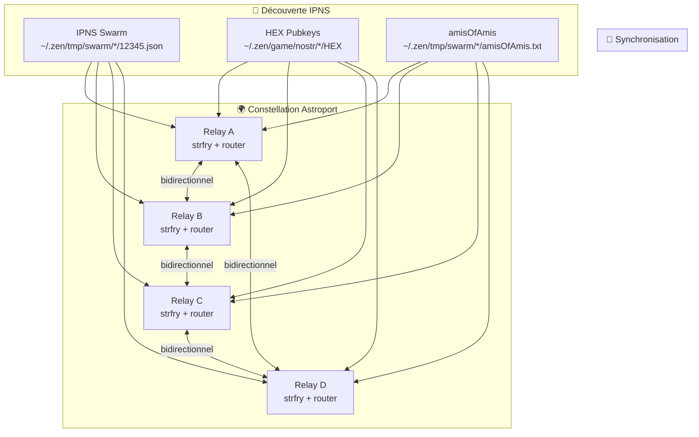

# 🌟 Astroport Constellation Synchronization System

> **Synchronisation automatique des événements Nostr entre les relays de la constellation Astroport**

[](https://github.com/astroport-one/constellation-sync)
[](https://github.com/astroport-one/constellation-sync)
[](LICENSE)

## 📖 Table des matières

- [🎯 Vue d'ensemble](#-vue-densemble)
- [🏗️ Architecture](#️-architecture)
- [⚡ Fonctionnalités](#-fonctionnalités)
- [🚀 Installation et configuration](#-installation-et-configuration)
- [📱 Utilisation](#-utilisation)
- [🔍 Monitoring et statistiques](#-monitoring-et-statistiques)
- [🛠️ Dépannage](#️-dépannage)
- [🔒 Sécurité](#-sécurité)
- [📊 Performance](#-performance)
- [🔮 Évolutions futures](#-évolutions-futures)

## 🎯 Vue d'ensemble

Le **Système de Synchronisation de Constellation Astroport** est une solution avancée qui permet aux relays Nostr de la constellation de se synchroniser automatiquement, créant un réseau distribué où tous les messages sont répliqués entre tous les participants.

### 🌟 Avantages clés

- **🔄 Synchronisation bidirectionnelle** automatique entre tous les relays
- **🎯 Filtrage intelligent** des événements UPlanet pertinents
- **🌐 Découverte automatique** des pairs via IPNS
- **📊 Monitoring en temps réel** avec statistiques détaillées
- **🚀 Performance optimisée** avec gestion intelligente des connexions
- **🔒 Sécurité intégrée** avec authentification et filtrage

## 🏗️ Architecture



### 🔧 Composants principaux

| Composant | Description | Fichier |
|-----------|-------------|---------|
| **strfry relay** | Relay Nostr principal | `~/.zen/strfry/strfry.conf` |
| **strfry router** | Synchronisation inter-relay | `~/.zen/strfry/strfry-router.conf` |
| **Peer Discovery** | Découverte automatique des pairs | `~/.zen/tmp/swarm/*/12345.json` |
| **HEX Monitor** | Surveillance des membres constellation | `~/.zen/game/nostr/*/HEX` |
| **Network Extender** | Extension du réseau via amisOfAmis | `~/.zen/tmp/swarm/*/amisOfAmis.txt` |

## ⚡ Fonctionnalités

### 🔄 Synchronisation automatique
- **Bidirectionnelle** : Événements synchronisés dans les deux sens
- **En temps réel** : Mise à jour instantanée entre tous les relays
- **Intelligente** : Filtrage automatique des types d'événements pertinents

### 🎯 Filtrage ciblé
- **Kind 0** : Profils utilisateurs (metadonnées, avatars, bios)
- **Kind 1** : Notes de texte (messages, publications)
- **Kind 3** : Listes de contacts (réseaux sociaux)
- **Kind 22242** : Événements d'authentification NIP-42

### 🌐 Découverte de pairs
- **Scan IPNS** : Découverte automatique via le swarm IPNS
- **Détection locale** : Support des relays localhost avec tunnels P2P
- **Mise à jour dynamique** : Configuration automatique des nouveaux pairs

### 📊 Monitoring avancé
- **Statistiques en temps réel** : Nombre d'événements, taille de base
- **Logs détaillés** : Traçabilité complète des opérations
- **Métriques de performance** : Latence, débit, erreurs

## 🚀 Installation et configuration

### 📋 Prérequis

```bash
# Vérifier que strfry est installé
ls -la ~/.zen/strfry/strfry

# Vérifier la structure des répertoires
ls -la ~/.zen/game/nostr/
ls -la ~/.zen/tmp/swarm/
```

### ⚙️ Configuration initiale

```bash
# 1. Le code se trouve dans le dépôt papiche/NIP-101
git clone https://github.com/papiche/NIP-101.git
cd NIP-101

# 2. strfry est installé par Astroport.ONE via install_strfry.sh
# et se trouve dans ~/.zen/strfry

# 3. Configuration automatique
./setup.sh

# 4. Vérifier la configuration
./test_constellation_sync.sh
```

### 🔧 Configuration manuelle

#### Fichier de configuration principal (`strfry.conf`)
```toml
# Configuration du relay principal
bind = "0.0.0.0"
port = 7777
db = "strfry-db"
```

#### Configuration du router (`strfry-router.conf`)
```toml
# Configuration de synchronisation
connectionTimeout = 30

streams {
    constellation {
        dir = "both"  # Bidirectionnel
        
        filter = { 
            "kinds": [0, 1, 3, 22242],
            "limit": 10000
        }
        
        urls = [
            "wss://relay.copylaradio.com",
            "ws://192.168.1.24:7777"
        ]
    }
}
```

## 🔄 Intégration avec _12345.sh

### ⏰ Déclenchement automatique

Le système de synchronisation de constellation est intégré avec le script `_12345.sh` d'Astroport.ONE et se déclenche automatiquement :

- **Cycle de synchronisation** : Après 12h00 (midi)
- **Période de backfill** : Depuis le midi de la veille (24h)
- **Intégration** : Dans le cycle principal de `_12345.sh`
- **Déclenchement** : Basé sur le timestamp MOATS

### 🔧 Configuration dans _12345.sh

```bash
# Dans _12345.sh, après la section "ZEN ECONOMY"
# et avant la boucle principale

## CONSTELLATION SYNC TRIGGER (after 12:00)
current_hour=$(date +%H)
if [[ $current_hour -ge 12 ]]; then
    # Trigger constellation sync for messages since yesterday noon
    ~/.zen/workspace/NIP-101/backfill_constellation.sh --days 1 --verbose &
fi
```

## 📱 Utilisation

### 🚀 Démarrer la synchronisation

```bash
# Démarrer la synchronisation
./start_constellation_sync.sh

# Vérifier le statut
./test_constellation_sync.sh

# Monitorer les logs
tail -f ~/.zen/strfry/constellation-sync.log
```

### ⏹️ Arrêter la synchronisation

```bash
# Arrêter proprement
./stop_constellation_sync.sh

# Vérifier l'arrêt
ps aux | grep "strfry router"
```

### 🔄 Backfill et synchronisation historique

```bash
# Synchronisation des derniers jours
./backfill_constellation.sh --days 7 --verbose

# Mode test (DRY RUN)
./backfill_constellation.sh --DRYRUN --verbose

# Synchronisation ciblée sur des auteurs spécifiques
./backfill_constellation.sh --show-hex
```

### 📊 Statistiques et monitoring

```bash
# Afficher les statistiques de la base
./backfill_constellation.sh --stats

# Monitorer en temps réel
tail -f ~/.zen/strfry/constellation-backfill.log

# Vérifier les pairs découverts
./backfill_constellation.sh --DRYRUN --verbose
```

## 🔍 Monitoring et statistiques

### 📈 Métriques disponibles

| Métrique | Description | Commande |
|----------|-------------|----------|
| **Événements totaux** | Nombre d'événements en base | `--stats` |
| **Taille base** | Taille de la base de données | `--stats` |
| **Pairs actifs** | Nombre de pairs connectés | `--DRYRUN` |
| **HEX surveillés** | Nombre de membres constellation | `--show-hex` |
| **Performance** | Latence et débit | Logs temps réel |

### 📊 Exemple de sortie

```bash
$ ./backfill_constellation.sh --stats

📊 Constellation Database Statistics:
====================================
Current events in database: 1,247
Database size: 4.2M
HEX files found: 23
amisOfAmis.txt files found: 2
Total HEX pubkeys monitored: 23

$ ./backfill_constellation.sh --show-hex

🔍 Constellation HEX Pubkeys:
==============================
Found 23 HEX pubkeys:
  - 71c26c8e...3cb17b89
  - 63c36b04...e3527e2c
  - efbd53fb...b9e24485
  # ... (20 autres)
```

### 📝 Logs et traçabilité

#### Fichiers de logs principaux
- **`constellation-sync.log`** : Logs du router de synchronisation
- **`constellation-backfill.log`** : Logs des opérations de backfill
- **`plugin.log`** : Logs du relay principal

#### Niveaux de log
- **INFO** : Informations générales
- **DEBUG** : Détails techniques
- **WARN** : Avertissements
- **ERROR** : Erreurs critiques

## 🛠️ Dépannage

### ❌ Problèmes courants

#### 1. Router ne démarre pas
```bash
# Vérifier le binaire strfry
ls -la ~/.zen/strfry/strfry

# Vérifier la configuration
./test_constellation_sync.sh

# Vérifier les logs
tail -f ~/.zen/strfry/constellation-sync.log
```

#### 2. Aucun pair découvert
```bash
# Vérifier le répertoire swarm
ls -la ~/.zen/tmp/swarm/

# Vérifier les fichiers 12345.json
find ~/.zen/tmp/swarm/ -name "12345.json" -exec cat {} \;

# Tester la connectivité réseau
ping -c 3 relay.copylaradio.com
```

#### 3. Synchronisation ne fonctionne pas
```bash
# Vérifier le processus router
ps aux | grep "strfry router"

# Vérifier les connexions
netstat -tulpn | grep :7777

# Tester manuellement
cd ~/.zen/strfry
./strfry router strfry-router.conf
```

### 🔍 Mode debug

```bash
# Exécution avec debug
bash -x ./setup.sh

# Vérification détaillée
./test_constellation_sync.sh --verbose

# Logs détaillés
tail -f ~/.zen/strfry/constellation-sync.log | grep -E "(DEBUG|ERROR)"
```

### 📋 Checklist de diagnostic

- [ ] Binaire strfry existe et est exécutable
- [ ] Fichiers de configuration présents
- [ ] Répertoires IPNS et HEX accessibles
- [ ] Connectivité réseau vers les pairs
- [ ] Ports 7777 et 8080 ouverts
- [ ] Permissions sur les répertoires

## 🔒 Sécurité

### 🛡️ Mesures de sécurité

- **Filtrage d'événements** : Seuls les types pertinents sont synchronisés
- **Limitation de débit** : Protection contre le spam et les attaques
- **Authentification** : Support des événements NIP-42
- **Isolation réseau** : Tunnels P2P pour les relays locaux

### 🔐 Bonnes pratiques

```bash
# Vérifier les permissions
chmod 600 ~/.zen/strfry/strfry.conf
chmod 600 ~/.zen/strfry/strfry-router.conf

# Limiter l'accès réseau
ufw allow from 192.168.1.0/24 to any port 7777

# Monitoring des connexions
watch -n 5 'netstat -tulpn | grep :7777'
```

### 🚨 Alertes de sécurité

- **Tentatives de connexion suspectes**
- **Volume d'événements anormal**
- **Erreurs d'authentification répétées**
- **Modifications non autorisées de la configuration**

## 📊 Performance

### ⚡ Optimisations

- **Filtrage intelligent** : Réduction du trafic réseau
- **Compression** : Optimisation de la bande passante
- **Gestion des connexions** : Pool de connexions réutilisables
- **Cache en mémoire** : Accès rapide aux événements fréquents

### 📈 Métriques de performance

| Métrique | Objectif | Monitoring |
|----------|----------|------------|
| **Latence** | < 100ms | `--stats` + logs |
| **Débit** | > 1000 evt/s | Métriques temps réel |
| **Mémoire** | < 512MB | `ps aux` |
| **CPU** | < 30% | `top` ou `htop` |

### 🔧 Tuning des performances

```bash
# Optimiser la base de données
cd ~/.zen/strfry
./strfry compact

# Ajuster les limites de connexion
echo "max_connections = 1000" >> strfry.conf

# Monitoring des performances
htop -p $(pgrep strfry)
```

## 🔮 Évolutions futures

### 🚀 Roadmap

#### Version 2.1 (Q2 2025)
- [ ] Interface web de gestion
- [ ] Métriques avancées avec Prometheus
- [ ] Support des événements éphémères
- [ ] Optimisation des requêtes NIP-15

#### Version 2.2 (Q3 2025)
- [ ] Découverte de pairs en temps réel
- [ ] Load balancing intelligent
- [ ] Chiffrement end-to-end
- [ ] Support des événements NIP-65

#### Version 3.0 (Q4 2025)
- [ ] Architecture microservices
- [ ] Support multi-protocoles
- [ ] Intelligence artificielle intégrée
- [ ] Marketplace d'extensions

### 💡 Idées d'amélioration

- **Machine Learning** : Prédiction des événements populaires
- **Blockchain** : Preuve de synchronisation décentralisée
- **IoT** : Support des capteurs et données temps réel
- **AR/VR** : Synchronisation des mondes virtuels

## 📚 Références

### 🔗 Liens utiles

- [Documentation strfry officielle](https://github.com/hoytech/strfry)
- [Spécification Nostr](https://github.com/nostr-protocol/nips)
- [Astroport.ONE](https://astroport.one)
- [UPlanet Ecosystem](https://uplanet.one)

### 📖 Documentation technique

- [Architecture détaillée](ARCHITECTURE.md)
- [API Reference](API.md)
- [Deployment Guide](DEPLOYMENT.md)
- [Contributing Guidelines](CONTRIBUTING.md)

### 🆘 Support

- **Issues GitHub** : [Report a bug](https://github.com/papiche/NIP-101/issues)
- **Discussions** : [Community forum](https://github.com/papiche/NIP-101/discussions)
- **Wiki** : [Documentation complète](https://github.com/papiche/NIP-101/wiki)

---

## 📄 Licence

Ce projet fait partie de l'écosystème Astroport.ONE et suit les mêmes conditions de licence.

**GPL-3.0** - Voir le fichier [LICENSE](LICENSE) pour plus de détails.

---

<div align="center">

**🌟 Construit avec ❤️ pour la communauté Astroport**

*Synchronisez votre constellation, connectez votre univers !*

</div>
