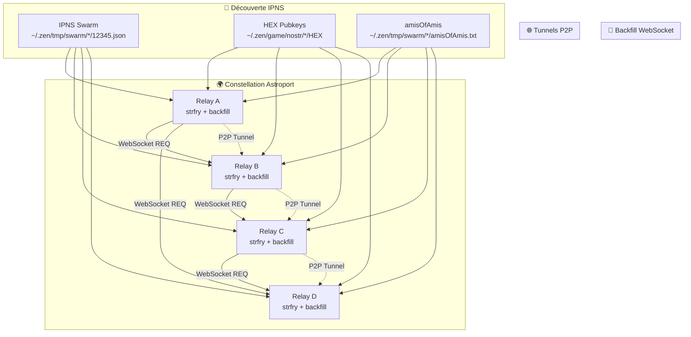

# 🌟 Astroport Constellation Synchronization System

> **Synchronisation automatique des événements Nostr entre les relays de la constellation Astroport**

[](https://github.com/papiche/NIP-101)
[](https://github.com/papiche/NIP-101)
[](LICENSE)

## 📖 Table des matières

- [🎯 Vue d'ensemble](#-vue-densemble)
- [🏗️ Architecture](#️-architecture)
- [⚡ Fonctionnalités](#-fonctionnalités)
- [🚀 Installation et configuration](#-installation-et-configuration)
- [📱 Utilisation](#-utilisation)
- [🔍 Monitoring et statistiques](#-monitoring-et-statistiques)
- [🛠️ Dépannage](#️-dépannage)
- [🔒 Sécurité](#-sécurité)
- [📊 Performance](#-performance)
- [🔮 Évolutions futures](#-évolutions-futures)

## 🎯 Vue d'ensemble

Le **Système de Synchronisation de Constellation Astroport** est une solution avancée qui permet aux relays Nostr de la constellation de récupérer automatiquement les événements historiques depuis les autres relays, créant un réseau distribué où tous les messages sont accessibles sur tous les participants.

### 🌟 **NIP-101 : Plus qu'une synchronisation - Un écosystème complet**

Le dépôt [NIP-101](https://github.com/papiche/NIP-101) fournit **l'infrastructure complète** pour un relay Nostr intelligent et sécurisé dans l'écosystème Astroport.ONE :

1. **🔄 Backfill de constellation** : Récupération automatique des événements historiques depuis les autres relays
2. **🛡️ Politique de filtrage avancée** : Gestion intelligente des événements entrants
3. **🤖 Intégration IA** : Réponses automatiques et gestion de la mémoire conversationnelle
4. **💰 Économie Zen** : Système de micro-paiements basé sur les réactions
5. **🌍 Géolocalisation** : Support des GeoKeys UPlanet et filtrage géographique

### 🌍 Contexte d'utilisation

Ce système est **spécifiquement conçu** pour l'écosystème Astroport.ONE et s'intègre dans le **cycle de vie quotidien** des nœuds constellation :

- **Déclenchement** : Automatique, après 12h00 (midi) via `_12345.sh`
- **Fréquence** : Une fois par jour pour éviter les doublons
- **Période** : Depuis le midi de la veille (24h de messages)
- **Intégration** : Dans le cycle principal de gestion du swarm IPFS
- **Ressources** : Partage les mêmes répertoires et services qu'Astroport.ONE

### 🎯 Cas d'usage typiques

1. **Nœuds constellation** : Synchronisation automatique des messages UPlanet
2. **Relays locaux** : Découverte et synchronisation via tunnels P2P
3. **Réseau étendu** : Inclusion des "amis d'amis" via `amisOfAmis.txt`
4. **Maintenance** : Backfill manuel pour récupérer des messages manqués
5. **Monitoring** : Suivi des statistiques et de la santé de la constellation

### 🌟 Avantages clés

- **🔄 Backfill automatique** des événements historiques depuis tous les relays
- **🎯 Filtrage intelligent** des événements UPlanet pertinents (exclusion des messages IA)
- **🌐 Découverte automatique** des pairs via IPNS
- **📊 Monitoring détaillé** avec statistiques et logs complets
- **🚀 Performance optimisée** avec connexions WebSocket et tunnels P2P
- **🔒 Sécurité intégrée** avec authentification et filtrage

## 🏗️ Architecture



### 🔧 Composants principaux

| Composant | Description | Fichier | Rôle dans Astroport.ONE |
|-----------|-------------|---------|-------------------------|
| **strfry relay** | Relay Nostr principal | `~/.zen/strfry/strfry.conf` | Service principal installé par `install_strfry.sh` |
| **backfill_constellation.sh** | Récupération événements historiques | `~/.zen/workspace/NIP-101/backfill_constellation.sh` | Script principal de backfill via WebSocket |
| **Peer Discovery** | Découverte automatique des pairs | `~/.zen/tmp/swarm/*/12345.json` | Scanné par `_12345.sh` pour découvrir le réseau |
| **HEX Monitor** | Surveillance des membres constellation | `~/.zen/game/nostr/*/HEX` | Membres directs de la constellation |
| **Network Extender** | Extension du réseau via amisOfAmis | `~/.zen/tmp/swarm/*/amisOfAmis.txt` | Réseau étendu découvert via le swarm |
| **constellation_sync_trigger.sh** | Déclencheur intelligent | `~/.zen/workspace/NIP-101/constellation_sync_trigger.sh` | Intégré dans `_12345.sh` pour la synchronisation |

### 🛡️ **Système de filtrage et politique de sécurité**

| Composant | Description | Fichier | Fonction |
|-----------|-------------|---------|----------|
| **all_but_blacklist.sh** | Politique principale d'écriture | `relay.writePolicy.plugin/all_but_blacklist.sh` | Gère l'acceptation/rejet des événements |
| **filter/1.sh** | Filtre des messages texte | `relay.writePolicy.plugin/filter/1.sh` | Gestion des visiteurs, mémoire IA, déclenchement IA |
| **filter/7.sh** | Filtre des réactions/likes | `relay.writePolicy.plugin/filter/7.sh` | Micro-paiements automatiques en Ğ1 |
| **filter/22242.sh** | Authentification NIP-42 | `relay.writePolicy.plugin/filter/22242.sh` | Vérification des événements d'authentification |
| **filter/9735.sh** | Gestion des listes | `relay.writePolicy.plugin/filter/9735.sh` | Filtrage des listes de contacts |
| **filter/1984.sh** | Gestion des événements | `relay.writePolicy.plugin/filter/1984.sh` | Filtrage des événements spécifiques |
| **filter/30023.sh** | Gestion des articles | `relay.writePolicy.plugin/filter/30023.sh` | Filtrage des articles longs |
| **filter/30078.sh** | Gestion des applications | `relay.writePolicy.plugin/filter/30078.sh` | Filtrage des événements d'application |

## ⚡ Fonctionnalités

### 🔄 Backfill automatique
- **Historique** : Récupération des événements des dernières 24h
- **Quotidien** : Exécution automatique après 12h00 via `_12345.sh`
- **Intelligent** : Filtrage automatique des types d'événements pertinents et exclusion des messages IA

### 🛡️ **Système de filtrage intelligent**
- **Politique d'écriture** : `all_but_blacklist.sh` gère l'acceptation/rejet global
- **Filtrage par type** : Scripts spécialisés pour chaque kind d'événement
- **Gestion des visiteurs** : Système d'avertissement et limitation pour les nouveaux utilisateurs
- **Blacklist dynamique** : Suppression automatique des clés MULTIPASS et amisOfAmis
- **Sécurité géographique** : Filtrage basé sur les coordonnées et GeoKeys UPlanet

### 🤖 **Intégration IA et mémoire**
- **Réponses automatiques** : Déclenchement de l'IA via `UPlanet_IA_Responder.sh`
- **Gestion de la mémoire** : Stockage conversationnel avec tags `#rec`, `#mem`, `#reset`
- **File d'attente intelligente** : Gestion des requêtes IA pour éviter la surcharge
- **Contexte géographique** : Mémoire UMAP basée sur latitude/longitude
- **Tags d'action** : `#search`, `#image`, `#video`, `#music`, `#youtube`, `#pierre`, `#amelie`

### 🎯 Filtrage ciblé
- **Kind 0** : Profils utilisateurs (metadonnées, avatars, bios)
- **Kind 1** : Notes de texte (messages, publications) - **Filtrage avancé avec IA**
- **Kind 3** : Listes de contacts (réseaux sociaux)
- **Kind 7** : Réactions/likes - **Micro-paiements automatiques en Ğ1**
- **Kind 1984** : Événements spécifiques UPlanet
- **Kind 22242** : Événements d'authentification NIP-42
- **Kind 30023** : Articles longs et publications
- **Kind 30078** : Événements d'application
- **Kind 9735** : Listes et collections

### 🌐 Découverte de pairs
- **Scan IPNS** : Découverte automatique via le swarm IPNS
- **Détection locale** : Support des relays localhost avec tunnels P2P
- **Mise à jour dynamique** : Découverte automatique des nouveaux pairs
- **Filtrage des messages IA** : Exclusion automatique des messages "Hello NOSTR visitor."
- **Support WebSocket** : Connexions directes et via tunnels P2P

### 📊 Monitoring avancé
- **Statistiques en temps réel** : Nombre d'événements, taille de base
- **Logs détaillés** : Traçabilité complète des opérations
- **Métriques de performance** : Latence, débit, erreurs
- **Logs de filtrage** : Traçabilité des décisions d'acceptation/rejet
- **Logs IA** : Suivi des interactions avec l'intelligence artificielle
- **Logs de paiements** : Traçabilité des micro-paiements en Ğ1
- **Logs de visiteurs** : Suivi des nouveaux utilisateurs et avertissements

## 🚀 Installation et configuration

### 📋 Prérequis

```bash
# 1. Vérifier que strfry est installé par Astroport.ONE
ls -la ~/.zen/strfry/strfry

# 2. Vérifier la structure des répertoires Astroport.ONE
ls -la ~/.zen/game/nostr/          # HEX pubkeys des membres constellation
ls -la ~/.zen/tmp/swarm/           # Découverte des pairs via IPNS
ls -la ~/.zen/workspace/NIP-101/   # Scripts de synchronisation

# 3. Vérifier que _12345.sh est en cours d'exécution
ps aux | grep "_12345.sh"
```

### ⚙️ Configuration initiale

```bash
# 1. Le code se trouve dans le dépôt papiche/NIP-101
git clone https://github.com/papiche/NIP-101.git
cd NIP-101

# 2. strfry est installé par Astroport.ONE via install_strfry.sh
# et se trouve dans ~/.zen/strfry
# Vérifier l'installation :
ls -la ~/.zen/strfry/strfry

# 3. Configuration automatique
./setup.sh

# 4. Vérifier la configuration
./test_constellation_sync.sh

# 5. Intégration avec _12345.sh (optionnel, se fait automatiquement)
# Le script _12345.sh détecte automatiquement la présence des scripts
```

### 🔄 Intégration automatique

Le système s'intègre **automatiquement** avec Astroport.ONE :

- **Détection** : `_12345.sh` détecte la présence de `constellation_sync_trigger.sh`
- **Exécution** : Se déclenche automatiquement après 12h00 dans le cycle principal
- **Gestion** : Utilise le système de logs et de monitoring d'Astroport.ONE
- **Ressources** : Partage les mêmes répertoires et configurations

### 🚀 **Installation via Astroport.ONE :**

```bash
# Installation automatique d'Astroport.ONE (inclut strfry)
bash <(curl -sL https://install.astroport.com)

# Cette commande installe automatiquement :
# - Astroport.ONE Station complète
# - strfry dans ~/.zen/strfry/
# - Configuration IPFS et swarm
# - Scripts de gestion (_12345.sh, etc.)

# Ensuite, cloner NIP-101 pour la synchronisation constellation
git clone https://github.com/papiche/NIP-101.git
cd NIP-101
./setup.sh
```

### 🎯 **Position dans l'écosystème :**

Le dépôt NIP-101 est **l'infrastructure NOSTR complète** d'Astroport.ONE :

- **Base** : Astroport.ONE fournit l'infrastructure IPFS et la gestion du swarm
- **Extension** : NIP-101 ajoute la synchronisation automatique des événements NOSTR
- **Sécurité** : Système de filtrage avancé avec politique d'écriture personnalisée
- **Intelligence** : Intégration IA avec gestion de la mémoire et réponses automatiques
- **Économie** : Système de micro-paiements en Ğ1 basé sur les réactions
- **Géolocalisation** : Support des GeoKeys UPlanet et filtrage géographique
- **Intégration** : Via `_12345.sh` qui gère le cycle de vie complet du nœud
- **Ressources** : Partage la même architecture de répertoires et de configuration

### 🔧 Configuration manuelle

#### Fichier de configuration principal (`strfry.conf`)
```toml
# Configuration du relay principal
bind = "0.0.0.0"
port = 7777
db = "strfry-db"
```

#### Configuration du relay principal (`strfry.conf`)
```toml
# Configuration du relay principal
bind = "0.0.0.0"
port = 7777
db = "strfry-db"

# Politique d'écriture personnalisée
writePolicy = "plugin"
writePolicyPlugin = "all_but_blacklist.sh"
```

## 🔄 Intégration avec _12345.sh

### ⏰ Déclenchement automatique

Le système de synchronisation de constellation est intégré avec le script `_12345.sh` d'Astroport.ONE et se déclenche automatiquement :

- **Cycle de synchronisation** : Après 12h00 (midi)
- **Période de backfill** : Depuis le midi de la veille (24h)
- **Intégration** : Dans le cycle principal de `_12345.sh`
- **Déclenchement** : Basé sur le timestamp MOATS et le cycle de vie du swarm

### 🔧 Configuration dans _12345.sh

```bash
# Dans _12345.sh, après la section "ZEN ECONOMY"
# et avant la boucle principale

### NOSTR RELAY SYNCHRO for LAST 24 H
if [[ -s ~/.zen/workspace/NIP-101/constellation_sync_trigger.sh ]]; then
    # Use constellation_sync_trigger.sh for robust constellation synchronization
    # This script handles locking, daily execution, and error management
    ~/.zen/workspace/NIP-101/constellation_sync_trigger.sh &
elif [[ -s ~/.zen/workspace/NIP-101/backfill_constellation.sh ]]; then
    # Fallback to direct backfill if trigger script not available
    current_hour=$(date +%H)
    if [[ $current_hour -ge 12 ]]; then
        ~/.zen/workspace/NIP-101/backfill_constellation.sh --days 1 --verbose &
    fi
fi
```

### 🎯 Contexte d'utilisation dans _12345.sh

Le script `_12345.sh` est le **cœur opérationnel** d'Astroport.ONE qui :

1. **Gère le swarm IPFS** : Synchronise les cartes de stations via IPNS
2. **Maintient la présence** : Publie périodiquement les métadonnées du nœud
3. **Découvre les pairs** : Scanne les nœuds bootstrap pour maintenir la vue réseau
4. **Intègre la constellation** : Déclenche la synchronisation Nostr après 12h00

**Position dans le cycle :**
- **Avant** : NOSTRCARD.refresh.sh (cartes Nostr)
- **Pendant** : Synchronisation constellation (après 12h00)
- **Après** : Scan des nœuds bootstrap et mise à jour du swarm

## 📱 Utilisation

### 🚀 Modes de synchronisation

#### **Mode automatique (recommandé)**
```bash
# La synchronisation se déclenche automatiquement via _12345.sh
# après 12h00 (midi) - aucune action manuelle requise

# Vérifier que _12345.sh est en cours d'exécution
ps aux | grep "_12345.sh"

# Monitorer les logs de synchronisation
tail -f ~/.zen/strfry/constellation-trigger.log
tail -f ~/.zen/strfry/constellation-backfill.log
```

#### **Mode manuel (pour tests ou maintenance)**
```bash
# Exécuter le backfill manuellement
./backfill_constellation.sh --days 1 --verbose

# Vérifier le statut
./backfill_constellation.sh --DRYRUN --verbose

# Monitorer les logs
tail -f ~/.zen/strfry/constellation-backfill.log
```

### ⏹️ Gestion du processus

```bash
# Vérifier le statut du trigger
ls -la ~/.zen/strfry/constellation-sync.lock
cat ~/.zen/strfry/last_constellation_sync

# Vérifier les processus en cours
ps aux | grep "backfill_constellation"
```

### 🔄 Backfill et synchronisation historique

```bash
# Synchronisation des derniers jours
./backfill_constellation.sh --days 7 --verbose

# Mode test (DRY RUN)
./backfill_constellation.sh --DRYRUN --verbose

# Synchronisation ciblée sur des auteurs spécifiques
./backfill_constellation.sh --show-hex

# Déclenchement manuel du trigger (pour tests)
./constellation_sync_trigger.sh
```

### ⏰ Rythme de backfill

- **Automatique** : Tous les jours après 12h00 via `_12345.sh`
- **Période** : Depuis le midi de la veille (24h de messages)
- **Déclenchement** : Intégré dans le cycle de vie du swarm IPFS
- **Gestion** : Une seule exécution par jour pour éviter les doublons
- **Filtrage** : Exclusion automatique des messages "Hello NOSTR visitor."

### 📊 Statistiques et monitoring

```bash
# Afficher les statistiques de la base
./backfill_constellation.sh --stats

# Monitorer en temps réel
tail -f ~/.zen/strfry/constellation-backfill.log

# Vérifier les pairs découverts
./backfill_constellation.sh --DRYRUN --verbose

# Vérifier le statut du trigger
ls -la ~/.zen/strfry/constellation-sync.lock
cat ~/.zen/strfry/last_constellation_sync
```

### 📈 Monitoring intégré avec Astroport.ONE

Le système utilise les **mêmes répertoires et logs** qu'Astroport.ONE :

- **Logs principaux** : `~/.zen/strfry/` (partagés avec strfry)
- **Temporaires** : `~/.zen/tmp/` (partagés avec le swarm)
- **Configuration** : `~/.zen/workspace/NIP-101/` (scripts de synchronisation)
- **Monitoring** : Intégré dans le cycle de vie d'`_12345.sh`

## 🔍 Monitoring et statistiques

### 📈 Métriques disponibles

### 🛡️ **Système de filtrage et sécurité**

#### **Politique principale d'écriture (`all_but_blacklist.sh`)**
```bash
# Gestion globale des événements entrants
- Accepte tous les événements par défaut
- Rejette les événements des clés blacklistées
- Suppression automatique des clés MULTIPASS et amisOfAmis
- Logs détaillés de toutes les décisions
```

#### **Filtrage par type d'événement**
- **`filter/1.sh`** : Messages texte avec gestion IA et visiteurs
- **`filter/7.sh`** : Réactions/likes avec micro-paiements automatiques
- **`filter/22242.sh`** : Authentification NIP-42
- **`filter/9735.sh`** : Listes de contacts
- **`filter/1984.sh`** : Événements UPlanet spécifiques
- **`filter/30023.sh`** : Articles longs
- **`filter/30078.sh`** : Événements d'application

#### **Gestion des visiteurs et sécurité**
- **Système d'avertissement** : Messages automatiques pour nouveaux utilisateurs
- **Limitation de messages** : Maximum 3 messages avant blacklist
- **Blacklist dynamique** : Suppression automatique des clés autorisées
- **Gestion des amisOfAmis** : Extension du réseau via `amisOfAmis.txt`

#### **Intégration IA et mémoire**
- **Déclenchement automatique** : Via tags `#BRO`, `#BOT`
- **Gestion de la mémoire** : Tags `#rec`, `#mem`, `#reset`
- **File d'attente intelligente** : Évite la surcharge de l'IA
- **Contexte géographique** : Mémoire UMAP basée sur coordonnées

| Métrique | Description | Commande |
|----------|-------------|----------|
| **Événements totaux** | Nombre d'événements en base | `--stats` |
| **Taille base** | Taille de la base de données | `--stats` |
| **Pairs actifs** | Nombre de pairs connectés | `--DRYRUN` |
| **HEX surveillés** | Nombre de membres constellation | `--show-hex` |
| **Performance** | Latence et débit | Logs temps réel |

### 📊 Exemple de sortie

```bash
$ ./backfill_constellation.sh --stats

📊 Constellation Database Statistics:
====================================
Current events in database: 1,247
Database size: 4.2M
HEX files found: 23
amisOfAmis.txt files found: 2
Total HEX pubkeys monitored: 23

$ ./backfill_constellation.sh --show-hex

🔍 Constellation HEX Pubkeys:
==============================
Found 23 HEX pubkeys:
  - 71c26c8e...3cb17b89
  - 63c36b04...e3527e2c
  - efbd53fb...b9e24485
  # ... (20 autres)
```

### 📝 Logs et traçabilité

#### Fichiers de logs principaux
- **`constellation-sync.log`** : Logs du router de synchronisation
- **`constellation-backfill.log`** : Logs des opérations de backfill
- **`constellation-trigger.log`** : Logs du déclencheur intelligent
- **`plugin.log`** : Logs du relay principal (partagé avec Astroport.ONE)

#### Niveaux de log
- **INFO** : Informations générales
- **DEBUG** : Détails techniques
- **WARN** : Avertissements
- **ERROR** : Erreurs critiques

## 🛠️ Dépannage

### ❌ Problèmes courants

#### 1. Backfill ne fonctionne pas
```bash
# Vérifier le binaire strfry
ls -la ~/.zen/strfry/strfry

# Vérifier la configuration
./backfill_constellation.sh --DRYRUN --verbose

# Vérifier les logs
tail -f ~/.zen/strfry/constellation-backfill.log
```

#### 2. Aucun pair découvert
```bash
# Vérifier le répertoire swarm
ls -la ~/.zen/tmp/swarm/

# Vérifier les fichiers 12345.json
find ~/.zen/tmp/swarm/ -name "12345.json" -exec cat {} \;

# Tester la connectivité réseau
ping -c 3 relay.copylaradio.com
```

#### 3. Backfill ne fonctionne pas
```bash
# Vérifier le processus backfill
ps aux | grep "backfill_constellation"

# Vérifier les connexions WebSocket
netstat -tulpn | grep :7777

# Tester manuellement
./backfill_constellation.sh --verbose
```

### 🔍 Mode debug

```bash
# Exécution avec debug
bash -x ./setup.sh

# Vérification détaillée
./test_constellation_sync.sh --verbose

# Logs détaillés
tail -f ~/.zen/strfry/constellation-sync.log | grep -E "(DEBUG|ERROR)"
```

### 📋 Checklist de diagnostic

- [ ] **Astroport.ONE** : `_12345.sh` est en cours d'exécution
- [ ] **strfry** : Binaire installé et exécutable dans `~/.zen/strfry/`
- [ ] **Configuration** : Fichiers de configuration strfry présents
- [ ] **Scripts** : Scripts de backfill dans `~/.zen/workspace/NIP-101/`
- [ ] **Répertoires** : IPNS et HEX accessibles dans `~/.zen/tmp/` et `~/.zen/game/`

- [ ] **Connectivité** : Réseau accessible vers les pairs constellation
- [ ] **Ports** : Ports 7777 (strfry) et 8080 (IPFS) ouverts
- [ ] **Permissions** : Droits d'écriture sur les répertoires de logs
- [ ] **Intégration** : `constellation_sync_trigger.sh` détecté par `_12345.sh`
- [ ] **Filtrage** : Exclusion des messages "Hello NOSTR visitor." fonctionnelle

## 🔒 Sécurité

### 🛡️ Mesures de sécurité

- **Filtrage d'événements** : Seuls les types pertinents sont synchronisés
- **Limitation de débit** : Protection contre le spam et les attaques
- **Authentification** : Support des événements NIP-42
- **Isolation réseau** : Tunnels P2P pour les relays locaux

### 🔐 Bonnes pratiques

```bash
# Vérifier les permissions
chmod 600 ~/.zen/strfry/strfry.conf
chmod 600 ~/.zen/strfry/strfry-router.conf

# Limiter l'accès réseau
ufw allow from 192.168.1.0/24 to any port 7777

# Monitoring des connexions
watch -n 5 'netstat -tulpn | grep :7777'
```

### 🚨 Alertes de sécurité

- **Tentatives de connexion suspectes**
- **Volume d'événements anormal**
- **Erreurs d'authentification répétées**
- **Modifications non autorisées de la configuration**

## 📊 Performance

### ⚡ Optimisations

- **Filtrage intelligent** : Réduction du trafic réseau
- **Compression** : Optimisation de la bande passante
- **Gestion des connexions** : Pool de connexions réutilisables
- **Cache en mémoire** : Accès rapide aux événements fréquents

### 📈 Métriques de performance

| Métrique | Objectif | Monitoring |
|----------|----------|------------|
| **Latence** | < 100ms | `--stats` + logs |
| **Débit** | > 1000 evt/s | Métriques temps réel |
| **Mémoire** | < 512MB | `ps aux` |
| **CPU** | < 30% | `top` ou `htop` |

### 🔧 Tuning des performances

```bash
# Optimiser la base de données
cd ~/.zen/strfry
./strfry compact

# Ajuster les limites de connexion
echo "max_connections = 1000" >> strfry.conf

# Monitoring des performances
htop -p $(pgrep strfry)
```

## 📚 Références

### 🔗 Liens utiles

- [Documentation strfry officielle](https://github.com/hoytech/strfry)
- [Spécification Nostr](https://github.com/nostr-protocol/nips)
- [Astroport.ONE](https://github.com/papiche/Astroport.ONE)
- [UPlanet ORIGIN](https://ipfs.copylaradio.com/ipns/copylaradio.com)
- [NIP-101 Repository](https://github.com/papiche/NIP-101)

### 🔧 Architecture Astroport.ONE

Le système de synchronisation de constellation s'intègre dans l'écosystème [Astroport.ONE](https://github.com/papiche/Astroport.ONE), une plateforme Web3 décentralisée qui permet aux utilisateurs de créer des ambassades numériques personnelles.

#### 🏗️ **Composants principaux d'Astroport.ONE :**
- **`_12345.sh`** : Script principal de gestion du swarm IPFS et de la constellation
- **`install_strfry.sh`** : Installation et configuration de strfry dans `~/.zen/strfry/`
- **`RUNTIME/`** : Services en arrière-plan (NOSTRCARD.refresh.sh, GEOKEYS_refresh.sh)
- **`tools/`** : Outils de génération de clés et de conversion
- **`~/.zen/`** : Répertoire racine de configuration et de données

#### 🌍 **Écosystème UPlanet :**
- **UPlanet ORIGIN** : Portail public de découverte et d'onboarding
- **UPlanet Ẑen** : Réseau coopératif réservé aux membres (ZENCARD & Captains)
- **Système Ẑen** : Unité de compte interne (1 Ẑen = 1€ dans le réseau coopératif)
- **Swarm IPFS** : Découverte automatique des nœuds via IPNS

#### 🚀 **Modèles d'adhésion :**
1. **MULTIPASS** (1 Ẑen/semaine) : Identité NOSTR souveraine + uDRIVE IPFS 10 Go
2. **ZENCARD** (5 Ẑen/semaine) : Cloud privé NextCloud 128 Go ( option d'achat )
3. **CAPTAIN** : Hébergement de Station + fourniture de services + formation complète

### 📚 **Documentation Astroport.ONE :**

- **🏗️ [ARCHITECTURE.md](https://github.com/papiche/Astroport.ONE/blob/master/ARCHITECTURE.md)** : Vue d'ensemble technique complète du système
- **📖 [DOCUMENTATION.md](https://github.com/papiche/Astroport.ONE/blob/master/DOCUMENTATION.md)** : Hub central de documentation pour tous les composants

## 🔧 Fonctionnement technique

### 🔄 **Mécanisme de backfill actuel**

Le système utilise une **approche WebSocket unifiée** pour récupérer les événements historiques :

#### **1. Découverte des pairs**
```bash
# Scan des fichiers 12345.json dans le swarm IPNS
~/.zen/tmp/swarm/*/12345.json → extraction de myRELAY et ipfsnodeid

# Distinction des types de relay
- Routable : wss:// ou ws:// avec IP publique
- Non-routable : ws://127.0.0.1:7777 (nécessite tunnel P2P)
```

#### **2. Connexion WebSocket**
```bash
# Pour les relays routables
WebSocket direct → wss://relay.copylaradio.com

# Pour les relays non-routables
1. Création tunnel P2P : ipfs p2p forward /x/strfry-{nodeid} /ip4/127.0.0.1/tcp/9999
2. Connexion WebSocket : ws://127.0.0.1:9999
```

#### **3. Requête Nostr**
```json
["REQ", "backfill", {
    "kinds": [0, 1, 3, 22242],
    "since": 1754995729,
    "limit": 10000,
    "authors": ["01f33753...", "039b3d71...", ...]
}]
```

#### **4. Filtrage et import**
```bash
# Filtrage automatique
jq '.[] | select(.content | test("Hello NOSTR visitor.") | not)'

# Import dans strfry
strfry import < events_filtered.ndjson
```

### 🛡️ **Filtrage des messages IA**

Le système **exclut automatiquement** les messages générés par l'IA du capitaine :

- **Détection** : Messages contenant "Hello NOSTR visitor."
- **Filtrage** : Exclusion avant import dans la base locale
- **Statistiques** : Comptage des messages filtrés vs importés
- **Logs** : Traçabilité complète du processus de filtrage

### 📊 **Exemple de sortie typique**
```bash
[2025-08-13 13:10:59] [INFO] Total events: 42
[2025-08-13 13:10:59] [INFO] Events after filtering: 7
[2025-08-13 13:10:59] [INFO] Removed 'Hello NOSTR visitor.' messages: 35
[2025-08-13 13:10:59] [INFO] ✅ Successfully imported 7 events to strfry
```

### 🆘 NIP-101 Support

- **Issues GitHub** : [Report a bug](https://github.com/papiche/NIP-101/issues)
- **Discussions** : [Community forum](https://github.com/papiche/NIP-101/discussions)
- **Wiki** : [Documentation complète](https://github.com/papiche/NIP-101/wiki)

---

## 📄 Licence

Ce projet fait partie de l'écosystème Astroport.ONE et suit les mêmes conditions de licence.

**AGPL-3.0** - Voir le fichier [LICENSE](LICENSE) pour plus de détails.

### 🔗 Intégration avec Astroport.ONE

Le système de synchronisation de constellation est **conçu spécifiquement** pour s'intégrer avec Astroport.ONE :

- **Dépendances** : Utilise les mêmes répertoires et services
- **Cycle de vie** : S'intègre dans le cycle principal d'`_12345.sh`
- **Ressources** : Partage la configuration strfry et les logs
- **Monitoring** : Utilise le même système de logs et de gestion des processus
- **Découverte** : Exploite le swarm IPFS déjà configuré par Astroport.ONE

### 🌟 **Vision et valeurs partagées :**

Astroport.ONE et NIP-101 partagent la même **philosophie de souveraineté numérique** :

- **🆓 Liberté** : Échapper au contrôle des géants technologiques
- **🏗️ Coopération** : Modèle économique coopératif (CopyLaRadio SCIC)
- **🌐 Décentralisation** : Infrastructure IPFS et réseau NOSTR distribués
- **💰 Économie réelle** : Système Ẑen basé sur la confiance et la coopération
- **🔒 Souveraineté** : Chaque utilisateur possède ses données et son identité

### 🎯 **Objectif de la constellation :**

La synchronisation de constellation NOSTR **renforce l'écosystème UPlanet** en :

- **Connectant** tous les membres de la constellation via des relays synchronisés
- **Préservant** l'historique des conversations et des événements UPlanet
- **Étendant** le réseau via les "amis d'amis" pour une croissance organique
- **Assurant** la résilience et la redondance des données NOSTR
- **Facilitant** la découverte et la connexion entre les membres de la communauté

### 💰 **Système économique Zen et micro-paiements**

#### **Micro-paiements automatiques (`filter/7.sh`)**
```bash
# Réactions positives déclenchent des paiements automatiques
- LIKE (+ 👍 ❤️ ♥️) → 0.1 Ğ1 au créateur du contenu
- Seuls les utilisateurs locaux peuvent envoyer des paiements
- Vérification automatique que l'auteur est membre UPlanet
- Logs détaillés de tous les paiements effectués
```

#### **Économie circulaire**
- **Créateurs de contenu** : Récompensés par les réactions
- **Infrastructure** : Soutenue par les paiements PAF
- **Communauté** : Bénéficie de l'engagement et de la qualité
- **Durabilité** : Modèle économique auto-suffisant

#### **Intégration avec l'écosystème Ğ1**
- **Portefeuilles Duniter** : Gestion des clés et paiements
- **Vérification automatique** : Recherche des clés dans UPlanet
- **Traçabilité complète** : Logs de tous les paiements
- **Sécurité** : Vérification des autorisations et des soldes

---

<div align="center">

**🌟 NIP-101 : L'infrastructure NOSTR complète d'Astroport.ONE**

*Backfill automatique, filtrage intelligent, exclusion des messages IA et économie Zen !*

**🔄 Constellation Backfill** • **🛡️ Filtrage Avancé** • **🤖 Exclusion IA** • **💰 Micro-paiements** • **🌍 GeoKeys UPlanet**

</div>
