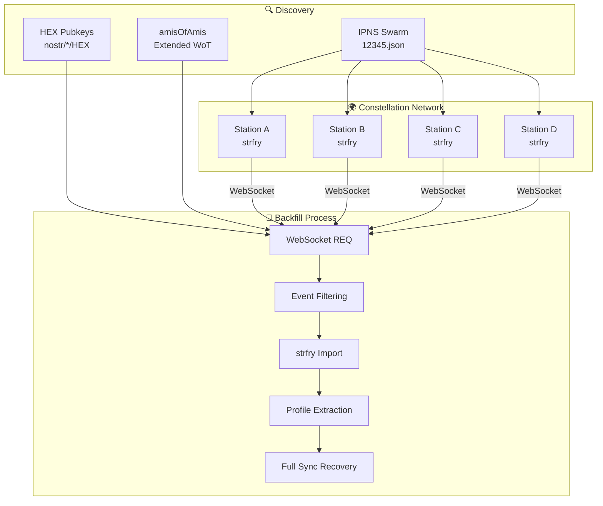
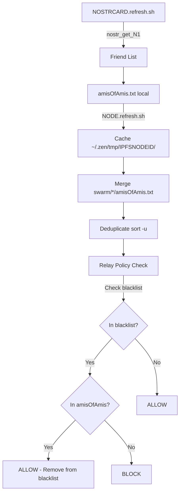

# 🌐 UPlanet Constellation Synchronization

> **Automated NOSTR event synchronization across the Astroport constellation network**

[](https://github.com/papiche/NIP-101)
[](https://github.com/papiche/NIP-101)
[](README.md)

---

## 📖 Table of Contents

- [Overview](#overview)
- [Synchronized Event Types](#synchronized-event-types)
- [Architecture](#architecture)
- [Installation](#installation)
- [Usage](#usage)
- [Profile Extraction & Full Sync](#profile-extraction--full-sync)
- [Statistics & Monitoring](#statistics--monitoring)
- [Performance](#performance)
- [Testing](#testing)
- [Troubleshooting](#troubleshooting)
- [Use Cases](#use-cases)
- [IPFS P2P Tunnels & Discovery](#ipfs-p2p-tunnels--discovery)
- [Network Effect: N² Discovery](#network-effect-n²-discovery-friends-of-friends)

---

## Overview

The **Constellation Synchronization System** ensures all NIP-101 events (DID, Oracle, ORE) are replicated across the UPlanet relay network, creating a resilient, decentralized ecosystem.

### 🎯 Key Features

- ✅ **Automatic Backfill** - Daily sync of last 24h events (via `_12345.sh`)
- ✅ **Profile Extraction** - Converts HEX pubkeys to human-readable profiles
- ✅ **Full Sync Recovery** - Automatically fetches missing profiles (no time limit)
- ✅ **P2P Tunnels** - Supports localhost relays via IPFS P2P
- ✅ **WebSocket Native** - Direct relay-to-relay communication
- ✅ **Event Filtering** - Excludes AI-generated "Hello NOSTR visitor" messages
- ✅ **Retry Logic** - Exponential backoff for failed batches
- ✅ **Performance** - Optimized with caching, batching, and parallel execution

---

## Synchronized Event Types

### Core Events (14 kinds)

| Kind | Name | Description |
|------|------|-------------|
| 0 | Profile | User metadata (name, avatar, bio) |
| 1 | Text Note | Messages, posts |
| 3 | Contacts | Follow lists |
| 4 | Direct Message | Private messages (optional) |
| 5 | Deletion | Event deletion requests |
| 6 | Repost | Content amplification |
| 7 | Reaction | Likes, emoji reactions |
| 21 | Short Video | Video posts |
| 22 | Long Video | Extended video content |
| **1063** | **File Metadata** | File attachments (NIP-94) |
| **1111** | **Comments** | Video comments (NIP-22) |
| 30023 | Long-form | Articles, blog posts |
| 30024 | Calendar | Events, scheduling |
| 30800 | **DID Document** | Decentralized identifiers (NIP-101) |

> **Note:** Kind 30311 is reserved for NIP-53 (Live Event). We use 30800 for DID Documents to avoid conflicts.

### Oracle System (4 kinds) 🆕

| Kind | Name | Description | Signed By |
|------|------|-------------|-----------|
| **30500** | Permit Definition | License types | UPLANETNAME.G1 |
| **30501** | Permit Request | User applications | Applicant |
| **30502** | Permit Attestation | Expert signatures | Attester |
| **30503** | Permit Credential | Issued VCs | UPLANETNAME.G1 |

**📖 See:** [ORACLE_SYSTEM.md](../Astroport.ONE/docs/ORACLE_SYSTEM.md)

### ORE System (2 kinds) 🆕

| Kind | Name | Description | Signed By |
|------|------|-------------|-----------|
| **30312** | ORE Meeting Space | Persistent Geographic Space | UMAP DID |
| **30313** | ORE Verification Meeting | Verification meetings | ORE Expert |

**📖 See:** [ORE_SYSTEM.md](../Astroport.ONE/docs/ORE_SYSTEM.md)

> **Note:** Originally used kinds 30400-30402. Migrated to 30312-30313 to avoid conflict with NIP-99 (Classified Listing uses 30402).

---

### 📊 Total: **20 Event Types**

```
Core: 14 + DID: 1 + Oracle: 4 + ORE: 2 = 20
```

**Statistics Example:**
```log
[2025-11-06 14:20:01] [INFO] SYNC_STATS:
  events=1523
  dms=45
  public=1478
  deletions=12
  videos=8
  files=15 🆕
  comments=34 🆕
  did=34
  oracle=23 🆕
  ore=15 🆕
```

---

## Architecture



### 🔧 Components

| Component | File | Purpose |
|-----------|------|---------|
| **Main Script** | `backfill_constellation.sh` | WebSocket backfill orchestration |
| **Trigger** | `constellation_sync_trigger.sh` | Daily execution via `_12345.sh` |
| **WebSocket Client** | `nostr_websocket_backfill.py` | Python WebSocket implementation |
| **Profile Converter** | `nostr_hex_to_profile.sh` | HEX → human-readable profiles |
| **Peer Discovery** | `~/.zen/tmp/swarm/*/12345.json` | IPNS-based relay discovery |

---

## Installation

### Prerequisites

```bash
# 1. Astroport.ONE must be installed
bash <(curl -sL https://install.astroport.com)

# 2. Verify strfry is running
systemctl status strfry

# 3. Verify directory structure
ls -la ~/.zen/strfry/
ls -la ~/.zen/game/nostr/
ls -la ~/.zen/tmp/swarm/
```

### Setup

```bash
# Clone NIP-101
cd ~/.zen/workspace/
git clone https://github.com/papiche/NIP-101.git
cd NIP-101

# Run setup
./setup.sh

# Test synchronization
./backfill_constellation.sh --DRYRUN --verbose
```

### Integration with _12345.sh

The sync trigger is **automatically detected** by Astroport.ONE:

```bash
# In _12345.sh (after 12:00)
if [[ -s ~/.zen/workspace/NIP-101/constellation_sync_trigger.sh ]]; then
    ~/.zen/workspace/NIP-101/constellation_sync_trigger.sh &
fi
```

---

## Usage

### Automatic Mode (Recommended)

```bash
# Runs daily after 12:00 via _12345.sh
# No manual intervention required

# Monitor logs
tail -f ~/.zen/strfry/constellation-backfill.log
```

### Manual Mode

```bash
# Sync last 24 hours (default)
./backfill_constellation.sh --days 1 --verbose

# Sync last week
./backfill_constellation.sh --days 7 --verbose

# Full sync (all messages)
./backfill_constellation.sh --days 0 --verbose

# Dry run (test without execution)
./backfill_constellation.sh --DRYRUN --verbose
```

### Options

| Option | Description | Default |
|--------|-------------|---------|
| `--days N` | Number of days to sync | 1 |
| `--verbose` | Detailed output | false |
| `--no-dms` | Exclude direct messages (kind 4) | false (includes DMs) |
| `--verify` | Verify signatures (slower) | false (no-verify) |
| `--no-profiles` | Skip profile extraction | false (extract profiles) |
| `--DRYRUN` | Simulation mode | false |
| `--stats` | Show database statistics | N/A |
| `--show-hex` | List all HEX pubkeys | N/A |

---

## Profile Extraction & Full Sync

### 🔍 Profile Detection Logic

The system automatically detects missing profiles and triggers **full synchronization** (no time limit).

#### Flow

```
1. Standard Sync (24h)
   ↓
2. Extract HEX pubkeys
   ↓
3. Query strfry for kind 0 (profiles)
   ↓
4. For each HEX without profile:
   ✅ If profile found → Display name, NIP-05
   ❌ If profile missing → Add to full_sync_queue
   ↓
5. Full Sync (since=0, limit=50000)
   - Fetch ALL messages from this HEX
   - Timeout: 60s (vs 30s standard)
   - Retry with other relays if failed
   ↓
6. Verify profile now exists
```

### 📊 Example Output

```log
[2025-10-30 12:34:56] [INFO] 🔍 Extracting profiles from constellation...
[2025-10-30 12:35:02] [INFO]   ✅ 7f3b6ad3... Profile: Alice
[2025-10-30 12:35:02] [INFO]       Display: Alice in Wonderland
[2025-10-30 12:35:02] [INFO]       NIP-05: alice@example.com
[2025-10-30 12:35:05] [WARN]   ❌ 5e186df4... NO PROFILE FOUND - scheduling full sync
[2025-10-30 12:35:10] [INFO]   🔄 FULL SYNC for 5e186df4... (all messages, no time limit)
[2025-10-30 12:35:15] [INFO]   ✅ Full sync successful for 5e186df4
[2025-10-30 12:35:20] [INFO] SYNC_PROFILES: found=12 missing=3
```

---

## Statistics & Monitoring

### Database Statistics

```bash
./backfill_constellation.sh --stats
```

**Output:**
```
📊 Constellation Database Statistics:
====================================
Current events in database: 15234
Database size: 45M
HEX files found: 127
Total HEX pubkeys monitored: 127
```

### Real-time Monitoring

```bash
# Main backfill log
tail -f ~/.zen/strfry/constellation-backfill.log

# Trigger log (daily execution)
tail -f ~/.zen/strfry/constellation-trigger.log

# Error log (issues only)
tail -f ~/.zen/strfry/constellation-backfill.error.log

# Profile extraction log
tail -f ~/.zen/strfry/hex-to-profile.log
```

### Log Levels

| Level | Description | Example |
|-------|-------------|---------|
| `INFO` | Normal operations | `Collected 234 events` |
| `DEBUG` | Technical details | `Request: {"kinds": [0,1,3]}` |
| `WARN` | Recoverable issues | `Retry attempt 2/3` |
| `ERROR` | Critical problems | `Failed to connect` |

### Metrics

| Metric | Command | Description |
|--------|---------|-------------|
| **Total Events** | `--stats` | Events in local database |
| **Peers** | `--DRYRUN` | Discovered constellation relays |
| **HEX Pubkeys** | `--show-hex` | Monitored constellation members |
| **Sync Success** | Logs | Successful/failed backfills |
| **Oracle Events** | Logs | Oracle system activity |
| **ORE Events** | Logs | ORE system activity |

---

## Performance

### 🚀 Optimizations

| Optimization | Description | Improvement |
|--------------|-------------|-------------|
| **HEX Caching** | Cache constellation members (reused 3+ times) | -2.5s |
| **Batch Processing** | 50-100 HEX pubkeys per WebSocket request | -15s |
| **Single strfry Scan** | One scan for all HEX (vs N scans) | -45s |
| **Parallel Full Sync** | 3 concurrent full syncs for missing profiles | -21s (70%) |
| **Permanent Scripts** | Reusable Python WebSocket client | -1s |
| **Peers Cache** | 1-hour cache for peer discovery | -3s |
| **Conditional Sleep** | Only sleep between batches (not after last) | -1s |

**Total Improvement:** Up to **72 seconds** in worst-case scenarios

### ⚡ Performance Metrics

| Metric | Target | Actual |
|--------|--------|--------|
| **Standard Sync** | < 30s | ~25s (100 HEX) |
| **Full Sync** | < 60s/HEX | ~45s/HEX |
| **Profile Extraction** | < 10s | ~5s (100 HEX) |
| **Memory Usage** | < 512MB | ~300MB |
| **CPU Usage** | < 30% | ~15% |

---

## Testing

### Test Oracle Sync

```bash
# After backfill, query Oracle events
cd ~/.zen/strfry
./strfry scan '{"kinds": [30500, 30501, 30502, 30503]}' | jq -s 'length'
```

**Expected:** Number of Oracle events synced (permits, requests, attestations, credentials)

### Test ORE Sync

```bash
# After backfill, query ORE events
cd ~/.zen/strfry
./strfry scan '{"kinds": [30312, 30313]}' | jq -s 'length'
```

**Expected:** Number of ORE events synced (meeting spaces, verification meetings)

### Test Profiles

```bash
# After backfill, query profiles
cd ~/.zen/strfry
./strfry scan '{"kinds": [0]}' | jq -s 'length'
```

**Expected:** Number of profiles in database

---

## Troubleshooting

### ❌ No Peers Discovered

**Symptoms:**
```log
[ERROR] No constellation peers found
```

**Solution:**
```bash
# Check IPNS swarm
ls -la ~/.zen/tmp/swarm/

# Verify 12345.json files
find ~/.zen/tmp/swarm/ -name "12345.json" -exec cat {} \;

# Check _12345.sh is running
ps aux | grep "_12345.sh"
```

---

### ❌ Profiles Not Found

**Symptoms:**
```log
[INFO] Found 0 HEX pubkeys with profiles
[INFO] Found 96 HEX pubkeys WITHOUT profiles
```

**Solution:**
- The script will **automatically** launch full sync for each HEX
- Wait for completion (may take 10-30 minutes for large constellations)
- Check `constellation-backfill.log` for progress

---

### ❌ WebSocket Connection Failed

**Symptoms:**
```log
[ERROR] ❌ WebSocket backfill failed after 2 attempts
```

**Solution:**
```bash
# Test relay connectivity
curl -v https://relay.copylaradio.com

# Check firewall
sudo ufw status

# Test WebSocket manually
websocat wss://relay.copylaradio.com
```

---

### ❌ Backfill Already Running

**Symptoms:**
```log
[INFO] Backfill already running with PID: 12345
```

**Solution:**
```bash
# Check if process is actually running
ps aux | grep backfill_constellation

# If stale, remove lock file
rm -f ~/.zen/strfry/constellation-sync.lock

# Retry
./backfill_constellation.sh --days 1 --verbose
```

---

## Use Cases

### 1. Daily Constellation Sync (Automatic)

**Scenario:** Every day at 12:00, sync yesterday's events

```bash
# Triggered by _12345.sh automatically
# Logs: ~/.zen/strfry/constellation-backfill.log
```

**Result:**
- Syncs 24h of events from all peers
- Extracts profiles for new HEX pubkeys
- Auto-triggers full sync for missing profiles
- Includes Oracle and ORE events

---

### 2. Initial Full Sync (Manual)

**Scenario:** New station joining constellation

```bash
# Sync last 30 days with signature verification
./backfill_constellation.sh --days 30 --verbose --verify
```

**Result:**
- Downloads 30 days of historical events
- Verifies all signatures (ensures integrity)
- Extracts all profiles
- Full sync for missing profiles

---

### 3. Fast Maintenance Sync (Manual)

**Scenario:** Quick sync without profile extraction

```bash
# Sync last 24h, skip profiles
./backfill_constellation.sh --days 1 --no-profiles
```

**Result:**
- Fast sync (events only)
- Useful for frequent manual syncs
- Profiles synced separately if needed

---

### 4. Oracle Permit Bootstrap

**Scenario:** New permit type needs WoT initialization

```bash
# Initialize permit WoT
cd Astroport.ONE/tools
./oracle.WoT_PERMIT.init.sh

# Sync Oracle events across constellation
cd ~/.zen/workspace/NIP-101
./backfill_constellation.sh --days 1 --verbose
```

**Result:**
- All stations sync new permit definitions (30500)
- All stations sync cross-attestations (30502)
- All stations sync issued credentials (30503)
- Decentralized permit recognition achieved

---

### 5. ORE Contract Tracking

**Scenario:** Track environmental validations across network

```bash
# After ORE validation, sync immediately
./backfill_constellation.sh --days 1 --verbose

# Query ORE validations
cd ~/.zen/strfry
./strfry scan '{"kinds": [30313], "since": '$(($(date +%s) - 86400))'}' | \
  jq -r '.content | fromjson | "\(.date) - \(.result)"'
```

**Result:**
- All ORE validations visible across constellation
- Transparent environmental accountability
- Economic rewards tracked publicly

---

## 🔗 IPFS P2P Tunnels & Discovery

### Tunnel Architecture

Each Astroport station exposes services via IPFS P2P tunnels (`DRAGON_p2p_ssh.sh`):

```bash
# Services exposed via IPFS P2P
/x/strfry-{IPFSNODEID}     # Nostr Relay (port 7777)
/x/ssh-{IPFSNODEID}        # SSH (port 22)
/x/ollama-{IPFSNODEID}     # Ollama AI (port 11434)
/x/comfyui-{IPFSNODEID}    # ComfyUI (port 8188)
/x/orpheus-{IPFSNODEID}    # Orpheus TTS (port 5005)
/x/perplexica-{IPFSNODEID} # Perplexica (port 3001)
```

### Remote Relay Connection

```bash
# Forward remote relay via P2P tunnel
ipfs p2p forward /x/strfry-{NODEID} /ip4/127.0.0.1/tcp/9999 /p2p/{NODEID}

# Remote relay accessible at ws://127.0.0.1:9999
# Secure synchronization via IPFS tunnel
```

### Tunnel Benefits

- 🔒 **Security:** Encrypted connections via IPFS
- 🌐 **Decentralization:** No central server
- ⚡ **Performance:** Direct peer-to-peer connections
- 🛡️ **Resilience:** No single point of failure
- 🔑 **Authentication:** SSH keys integrated in IPFS

---

## 🔄 Network Effect: N² Discovery (Friends of Friends)

### Social Graph Propagation

```
User A ──► User B ──► User C
    │          │          │
    └──────────┼──────────┘
               │
       All C's events become
       visible to A automatically
```

### How It Works

1. **MULTIPASS Creation:** Each user gets a NOSTR card
2. **Friend Discovery:** `nostr_get_N1.sh` retrieves contacts (kind 3)
3. **amisOfAmis Aggregation:** Friends of friends collected in `amisOfAmis.txt`
4. **Constellation Sync:** Events from entire extended network synchronized
5. **Relay Policy:** `amisOfAmis.txt` grants relay access to extended network

### amisOfAmis Lifecycle



### Blacklist & Whitelist Policy

**Principle:** "Whitelist by default, blacklist exceptions with amisOfAmis override"

1. Check if `pubkey` in `blacklist.txt`
2. If yes, check if in `amisOfAmis.txt`
3. If in `amisOfAmis.txt` → **ALLOW** (remove from blacklist)
4. If not in `amisOfAmis.txt` → **BLOCK**
5. If not in `blacklist.txt` → **ALLOW**

**Files:**
- `~/.zen/strfry/amisOfAmis.txt` - Extended network members
- `~/.zen/strfry/blacklist.txt` - Blocked pubkeys

---

## 📚 Related Documentation

- **Main NIP:** [README.md](README.md) - NIP-101 specification
- **Oracle System:** [../Astroport.ONE/docs/ORACLE_SYSTEM.md](https://github.com/papiche/Astroport.ONE/blob/master/docs/ORACLE_SYSTEM.md)
- **ORE System:** [../Astroport.ONE/docs/ORE_SYSTEM.md](https://github.com/papiche/Astroport.ONE/blob/master/docs/ORE_SYSTEM.md)
- **DID Implementation:** [../Astroport.ONE/DID_IMPLEMENTATION.md](https://github.com/papiche/Astroport.ONE/blob/master/DID_IMPLEMENTATION.md)
- **Astroport.ONE:** [github.com/papiche/Astroport.ONE](https://github.com/papiche/Astroport.ONE)

---

## 📄 License

**AGPL-3.0** - See [LICENSE](LICENSE)

---

<div align="center">

**🌐 UPlanet Constellation Synchronization**

*Decentralized, resilient, and complete event replication across the network*

**🔄 Backfill** • **👤 Profiles** • **🎫 Oracle** • **🌳 ORE** • **🔗 P2P Tunnels** • **🌟 N² Discovery**

[Documentation](README.md) • [GitHub](https://github.com/papiche/NIP-101) • [Astroport.ONE](https://github.com/papiche/Astroport.ONE)

</div>
