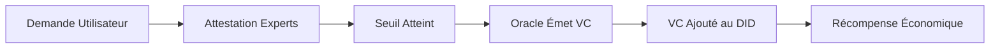

# NIP-101 : Protocole d'Identité Décentralisée et Coordination Géographique UPlanet

`brouillon` `optionnel`

**Auteurs :** Contributeurs Astroport.ONE  
**Statut :** Brouillon pour Revue Communautaire  
**Version :** 2.0  
**Dépôt :** [github.com/papiche/NIP-101](https://github.com/papiche/NIP-101)

---

## Résumé

NIP-101 définit un protocole complet pour la **gestion d'identité décentralisée**, la **coordination géographique** et les **crédentials vérifiables** sur Nostr. Il étend le protocole Nostr avec quatre systèmes intégrés :

1. **GeoKeys Hiérarchiques** - Paires de clés Nostr dérivées de coordonnées géographiques
2. **Identité Décentralisée (DID)** - Identités conformes W3C stockées comme événements Nostr (kind 30311)
3. **Système Oracle** - Gestion de permis multi-signature utilisant la Web of Trust (kinds 30500-30503)
4. **Système ORE** - Obligations environnementales attachées aux cellules géographiques (kinds 30400-30402)

Ce NIP permet la **communication géographiquement localisée**, l'**identité auto-souveraine**, les **crédentials validés par les pairs** et le **suivi des engagements écologiques** sur un réseau totalement décentralisé.

---

## Table des Matières

- [Motivation](#motivation)
- [Spécification](#spécification)
  - [1. GeoKeys Hiérarchiques](#1-geokeys-hiérarchiques)
  - [2. Identité Décentralisée (DID)](#2-identité-décentralisée-did)
  - [3. Système Oracle (Permis)](#3-système-oracle-permis)
  - [4. Système ORE (Obligations Environnementales)](#4-système-ore-obligations-environnementales)
  - [5. Tags d'Événements](#5-tags-dévénements)
- [Implémentation](#implémentation)
  - [Synchronisation de Constellation](#synchronisation-de-constellation)
  - [Authentification (NIP-42)](#authentification-nip-42)
  - [Gestion des Clés](#gestion-des-clés)
- [Cas d'Usage](#cas-dusage)
- [Considérations de Sécurité](#considérations-de-sécurité)
- [Références](#références)

---

## Motivation

### Problèmes Résolus

Les implémentations Nostr actuelles manquent :
- **Contexte géographique** pour la communication basée sur la localisation
- **Documents d'identité standardisés** pour l'identité auto-souveraine
- **Crédentials vérifiables** pour la compétence et l'autorité
- **Mécanismes de responsabilité environnementale**

### Solution UPlanet

**NIP-101** fournit un protocole unifié qui :
- ✅ Crée des **flux Nostr localisés** (UMAP, SECTOR, REGION)
- ✅ Implémente des **DIDs conformes W3C** sur Nostr (pas de registres centralisés)
- ✅ Permet la **certification par les pairs** (permis de conduire, certifications professionnelles)
- ✅ Suit les **engagements environnementaux** avec des incitations économiques
- ✅ Supporte la **synchronisation de constellation** entre plusieurs relais

---

## Spécification

### 1. GeoKeys Hiérarchiques

Les paires de clés Nostr sont **dérivées de manière déterministe** à partir de coordonnées géographiques et d'une chaîne d'espace de noms.

#### Dérivation de Clés

**Format de Graine :**
```
"{UPLANETNAME}_{LATITUDE_FORMATÉE}" "{UPLANETNAME}_{LONGITUDE_FORMATÉE}"
```

Utilisé comme sel et poivre [libsodium](https://doc.libsodium.org/) pour la génération de clés déterministe.

#### Niveaux de Grille

| Niveau | Précision | Taille Zone | Exemple de Graine |
|--------|-----------|-------------|-------------------|
| **UMAP** | 0.01° | ~1,2 km² | `"UPlanetV148.85-2.34"` |
| **SECTOR** | 0.1° | ~100 km² | `"UPlanetV148.8-2.3"` |
| **REGION** | 1.0° | ~10 000 km² | `"UPlanetV148-2"` |

#### Algorithme de Génération de Clés

Utilise l'outil `keygen` d'Astroport pour générer :
- **Paire de clés NOSTR** (secp256k1)
- **Clé IPFS** (ed25519)
- **Portefeuille Ğ1** (ed25519)
- **Adresse Bitcoin** (secp256k1)

Toutes à partir de la même graine, créant un mécanisme de **Clés Jumelles**.

---

### 2. Identité Décentralisée (DID)

#### Type d'Événement : `kind:30311`

Les DIDs sont stockés comme **Événements Remplaçables Paramétrés** ([NIP-33](https://github.com/nostr-protocol/nips/blob/master/33.md)).

#### Tags Standard

```json
{
  "kind": 30311,
  "tags": [
    ["d", "did"],
    ["t", "uplanet"],
    ["t", "did-document"]
  ],
  "content": "{DOCUMENT_DID_JSON}"
}
```

#### Structure du Document DID

```json
{
  "@context": [
    "https://www.w3.org/ns/did/v1",
    "https://w3id.org/security/suites/ed25519-2020/v1"
  ],
  "id": "did:nostr:<hex_pubkey>",
  "verificationMethod": [{
    "id": "did:nostr:<hex_pubkey>#key-1",
    "type": "Ed25519VerificationKey2020",
    "controller": "did:nostr:<hex_pubkey>",
    "publicKeyMultibase": "z<clé_encodée_base58btc>"
  }],
  "service": [
    {
      "id": "#ipfs-drive",
      "type": "IPFSDrive",
      "serviceEndpoint": "ipns://<clé_ipfs>/<email>/APP"
    },
    {
      "id": "#g1-wallet",
      "type": "Ğ1Wallet",
      "serviceEndpoint": "g1:<g1_pubkey>"
    }
  ],
  "verifiableCredential": [
    {
      "@context": "https://www.w3.org/2018/credentials/v1",
      "id": "urn:uuid:...",
      "type": ["VerifiableCredential", "UPlanetLicense"],
      "issuer": "did:nostr:<hex_autorité>",
      "credentialSubject": {
        "id": "did:nostr:<hex_sujet>",
        "license": "PERMIT_ORE_V1"
      }
    }
  ],
  "metadata": {
    "email": "user@example.com",
    "contractStatus": "active",
    "created": "2024-01-01T12:00:00Z",
    "updated": "2025-10-30T14:30:00Z"
  }
}
```

#### Résolution DID

- **Format :** `did:nostr:<hex_pubkey>`
- **Requête :** S'abonner aux événements `kind:30311` où `pubkey == <hex_pubkey>`
- **Vérification :** Utiliser la `verificationMethod` embarquée pour vérifier les signatures

#### Avantages

- ✅ **Pas de registres centralisés** (les relais Nostr sont la source de vérité)
- ✅ **Auto-souverain** (les utilisateurs contrôlent leur identité via clé privée)
- ✅ **Conforme W3C** (fonctionne avec les résolveurs DID standards)
- ✅ **Multi-chaîne** (lie NOSTR, IPFS, Ğ1, Bitcoin)
- ✅ **Crédentials Vérifiables** (embarqués dans le document DID)

---

### 3. Système Oracle (Permis)

Le Système Oracle permet la **certification validée par les pairs** utilisant le modèle Web of Trust.

#### Types d'Événements NOSTR

| Kind | Nom | Description | Signé par | Remplaçabilité |
|------|-----|-------------|-----------|----------------|
| **30500** | Définition de Permis | Définition de type de licence | `UPLANETNAME.G1` | Paramétré Remplaçable |
| **30501** | Demande de Permis | Demande d'un utilisateur | Demandeur | Paramétré Remplaçable |
| **30502** | Attestation de Permis | Signature d'expert | Attesteur | Paramétré Remplaçable |
| **30503** | Credential de Permis | VC final | `UPLANETNAME.G1` | Paramétré Remplaçable |

#### Structure des Événements

##### 30500 : Définition de Permis
```json
{
  "kind": 30500,
  "pubkey": "<UPLANETNAME_G1_hex>",
  "tags": [
    ["d", "PERMIT_ORE_V1"],
    ["t", "uplanet"],
    ["t", "permit-definition"]
  ],
  "content": "{
    \"id\": \"PERMIT_ORE_V1\",
    \"name\": \"Vérificateur Environnemental ORE\",
    \"description\": \"Autorité pour vérifier les contrats ORE\",
    \"min_attestations\": 5,
    \"validity_years\": 3,
    \"reward_zen\": 10
  }"
}
```

##### 30501 : Demande de Permis
```json
{
  "kind": 30501,
  "pubkey": "<hex_demandeur>",
  "tags": [
    ["d", "<id_demande>"],
    ["permit", "PERMIT_ORE_V1"],
    ["t", "uplanet"]
  ],
  "content": "{
    \"statement\": \"J'ai une expertise en validation écologique\",
    \"evidence\": \"https://ipfs.io/ipfs/Qm...\"
  }"
}
```

##### 30502 : Attestation de Permis
```json
{
  "kind": 30502,
  "pubkey": "<hex_attesteur>",
  "tags": [
    ["d", "<id_attestation>"],
    ["e", "<id_événement_demande>"],
    ["p", "<hex_demandeur>"],
    ["permit", "PERMIT_ORE_V1"]
  ],
  "content": "{
    \"statement\": \"J'atteste la compétence de ce demandeur\",
    \"date\": \"2025-10-30T12:00:00Z\"
  }"
}
```

##### 30503 : Credential de Permis (VC)
```json
{
  "kind": 30503,
  "pubkey": "<UPLANETNAME_G1_hex>",
  "tags": [
    ["d", "<id_credential>"],
    ["p", "<hex_détenteur>"],
    ["permit", "PERMIT_ORE_V1"]
  ],
  "content": "{
    \"@context\": \"https://www.w3.org/2018/credentials/v1\",
    \"id\": \"urn:uuid:...\",
    \"type\": [\"VerifiableCredential\", \"UPlanetLicense\"],
    \"issuer\": \"did:nostr:<UPLANETNAME_G1_hex>\",
    \"issuanceDate\": \"2025-10-30T12:00:00Z\",
    \"expirationDate\": \"2028-10-30T12:00:00Z\",
    \"credentialSubject\": {
      \"id\": \"did:nostr:<hex_détenteur>\",
      \"license\": \"PERMIT_ORE_V1\",
      \"attestations\": 5
    }
  }"
}
```

#### Bootstrap WoT ("Block 0")

**Problème :** Comment initialiser un permis quand aucun détenteur n'existe encore ?

**Solution :** Pour un permis nécessitant **N signatures**, enregistrer **N+1 membres MULTIPASS** sur la station.

**Processus d'Attestation Croisée :**
1. Chaque membre atteste tous les autres membres (sauf lui-même)
2. Résultat : Chaque membre reçoit **N attestations**
3. L'Oracle émet des credentials à tous les membres simultanément

**Exemples :**
- **PERMIT_ORE_V1** (5 signatures) → 6 membres (chacun reçoit 5 attestations)
- **PERMIT_DRIVER** (12 signatures) → 13 membres (chacun reçoit 12 attestations)
- **PERMIT_WOT_DRAGON** (3 signatures) → 4 membres (chacun reçoit 3 attestations)

#### Cycle de Vie d'un Permis



#### Permis Disponibles

| ID Permis | Nom | Attestations | Validité | Récompense |
|-----------|-----|--------------|----------|------------|
| PERMIT_ORE_V1 | Vérificateur ORE | 5 | 3 ans | 10 Ẑen |
| PERMIT_DRIVER | Permis de Conduire | 12 | 15 ans | 5 Ẑen |
| PERMIT_WOT_DRAGON | Autorité UPlanet | 3 | Illimitée | 50 Ẑen |
| PERMIT_MEDICAL_FIRST_AID | Premiers Secours | 8 | 2 ans | 8 Ẑen |
| PERMIT_BUILDING_ARTISAN | Artisan | 10 | 5 ans | 12 Ẑen |
| PERMIT_EDUCATOR_COMPAGNON | Éducateur | 12 | Illimitée | 15 Ẑen |
| PERMIT_FOOD_PRODUCER | Producteur Alimentaire | 6 | 3 ans | 8 Ẑen |
| PERMIT_MEDIATOR | Médiateur | 15 | 5 ans | 20 Ẑen |

---

### 4. Système ORE (Obligations Environnementales)

Le Système ORE attache des **obligations environnementales** aux cellules géographiques (UMAP), créant un registre écologique décentralisé.

#### Types d'Événements NOSTR

| Kind | Nom | Description | Signé par |
|------|-----|-------------|-----------|
| **30400** | Définition ORE | Contrat environnemental | DID UMAP |
| **30401** | Validation ORE | Rapport de vérification | Expert ORE |
| **30402** | Récompense ORE | Confirmation de paiement | UPLANETNAME.RnD |

#### Structure des Événements

##### 30400 : Définition ORE
```json
{
  "kind": 30400,
  "pubkey": "<UMAP_hex>",
  "tags": [
    ["d", "<id_contrat_ore>"],
    ["latitude", "43.60"],
    ["longitude", "1.44"],
    ["t", "uplanet"],
    ["t", "ore-contract"]
  ],
  "content": "{
    \"contractId\": \"ORE-2025-001\",
    \"description\": \"Maintenir 80% de couverture forestière\",
    \"provider\": \"did:nostr:<hex_vérificateur>\",
    \"reward\": \"10\",
    \"validationMethod\": \"satellite\",
    \"frequency\": \"annuel\"
  }"
}
```

##### 30401 : Validation ORE
```json
{
  "kind": 30401,
  "pubkey": "<hex_expert>",
  "tags": [
    ["d", "<id_validation>"],
    ["e", "<id_événement_contrat_ore>"],
    ["permit", "PERMIT_ORE_V1"],
    ["latitude", "43.60"],
    ["longitude", "1.44"]
  ],
  "content": "{
    \"result\": \"conforme\",
    \"evidence\": \"ipfs://Qm...\",
    \"method\": \"imagerie_satellite\",
    \"date\": \"2025-10-30T12:00:00Z\",
    \"notes\": \"Couverture forestière : 82%\"
  }"
}
```

##### 30402 : Récompense ORE
```json
{
  "kind": 30402,
  "pubkey": "<UPLANETNAME_RnD_hex>",
  "tags": [
    ["d", "<id_récompense>"],
    ["e", "<id_événement_validation>"],
    ["p", "<UMAP_hex>"],
    ["amount", "10"]
  ],
  "content": "{
    \"transaction_id\": \"G1_TX_123...\",
    \"amount\": \"10\",
    \"currency\": \"ZEN\",
    \"date\": \"2025-10-30T12:05:00Z\"
  }"
}
```

#### ORE dans les Documents DID

Les obligations environnementales sont stockées dans le document DID de l'UMAP (kind 30311) :

```json
{
  "id": "did:nostr:<UMAP_hex>",
  "type": "UMAPGeographicCell",
  "geographicMetadata": {
    "coordinates": {"lat": 43.60, "lon": 1.44}
  },
  "environmentalObligations": {
    "oreContract": {
      "contractId": "ORE-2025-001",
      "description": "Maintenir 80% de couverture forestière",
      "provider": "did:nostr:<hex_vérificateur>",
      "reward": "10"
    },
    "verificationStatus": "vérifié",
    "lastVerification": "2025-10-30T12:00:00Z"
  }
}
```

#### Flux Économique

```
1. Contrat ORE → DID UMAP (kind 30311)
2. Validation Expert → Événement NOSTR (kind 30401)
3. Paiement Automatique → UPLANETNAME.RnD → Portefeuille UMAP (kind 30402)
4. Redistribution UMAP → Gardiens/résidents locaux
```

#### Comparaison des Coûts

| Aspect | ORE Traditionnel (Notarié) | ORE UPlanet (Décentralisé) |
|--------|----------------------------|----------------------------|
| **Frais de Notaire** | 1 500€ - 3 000€ | 0€ |
| **Rédaction Juridique** | 2 000€ - 5 000€ | 0€ |
| **Registre** | 500€ - 1 000€ | 0€ |
| **Audit Annuel** | 1 000€ - 2 000€/an | Experts bénévoles |
| **Vérification** | Visites sur place | Satellite + IoT + VDO.ninja |
| **Total (5 ans)** | 9 500€ - 19 000€ | ~50€ (hébergement) |

**Économies :** Réduction de coût de **99,7%** tout en augmentant la transparence et la participation.

---

### 5. Tags d'Événements

Tous les événements UPlanet DEVRAIENT inclure ces tags :

#### Tags Géographiques
```json
["latitude", "CHAÎNE_FLOAT"]
["longitude", "CHAÎNE_FLOAT"]
["application", "UPlanet"]
```

#### Tags d'Identité
```json
["did", "did:nostr:<hex_pubkey>"]
["t", "uplanet"]
```

#### Tags de Permis (30501-30503)
```json
["permit", "ID_PERMIS"]
["e", "<id_événement_lié>"]
["p", "<pubkey_liée>"]
```

#### Tags ORE (30400-30402)
```json
["ore", "ID_CONTRAT_ORE"]
["latitude", "CHAÎNE_FLOAT"]
["longitude", "CHAÎNE_FLOAT"]
```

---

## Implémentation

### Synchronisation de Constellation

Les relais UPlanet synchronisent tous les événements NIP-101 à travers le réseau de constellation.

#### Types d'Événements Synchronisés

| Catégorie | Kinds | Description |
|-----------|-------|-------------|
| **Base** | 0, 1, 3, 5, 6, 7 | Profils, notes, contacts, suppressions, reposts, réactions |
| **Média** | 21, 22 | Vidéos (courte/longue forme) |
| **Contenu** | 30023, 30024 | Articles, événements calendrier |
| **Identité** | 30311 | Documents DID |
| **Oracle** | 30500-30503 | Permis (définitions, demandes, attestations, credentials) |
| **ORE** | 30400-30402 | Obligations environnementales (contrats, validations, récompenses) |

**Total :** **19 types d'événements** synchronisés automatiquement

#### Processus de Backfill

```bash
# Synchronisation quotidienne automatique (via _12345.sh)
./backfill_constellation.sh --days 1

# Synchronisation manuelle complète
./backfill_constellation.sh --days 7 --verbose

# Voir les statistiques de constellation
./backfill_constellation.sh --stats
```

#### Exemple de Statistiques

```log
[2025-10-30 12:35:12] [INFO] SYNC_STATS: 
  events=1523 
  dms=45 
  public=1478 
  deletions=12 
  videos=8 
  did=34 
  oracle=23 
  ore=15
```

---

### Authentification (NIP-42)

Toutes les opérations API UPlanet nécessitent l'**authentification NIP-42**.

#### Flux d'Authentification

1. **Client** génère un événement d'auth (kind 22242)
2. **Client** envoie l'événement d'auth au relais
3. **Serveur** interroge le relais pour un événement d'auth récent
4. **Serveur** vérifie la signature et le challenge
5. **Serveur** autorise la requête

---

### Gestion des Clés

#### Mécanisme de Clés Jumelles

À partir d'une seule graine, générer :
- **Paire de clés NOSTR** (identité)
- **Clé IPFS** (stockage)
- **Portefeuille Ğ1** (économie)
- **Adresse Bitcoin** (interopérabilité)

#### Partage de Secret Shamir (SSSS)

Les clés privées sont divisées en **3 fragments** :
- Fragment 1 → Stockage local
- Fragment 2 → Sauvegarde chiffrée IPFS
- Fragment 3 → Gardien de confiance

**Reconstitution :** N'importe quels **2 fragments** peuvent restaurer la clé privée complète.

---

## Cas d'Usage

### 1. Chat Communautaire Localisé

**Scénario :** Alice poste depuis son quartier UMAP.

### 2. Certification Vérificateur ORE

**Scénario :** Carol veut devenir vérificateur ORE.

### 3. Suivi des Engagements Environnementaux

**Scénario :** L'UMAP de Dave s'engage à maintenir la couverture forestière.

### 4. Alerte Météo Automatisée

**Scénario :** Service automatisé publie des alertes météo pour la REGION Paris.

### 5. Reconnaissance Multi-Station des Permis

**Scénario :** Alice a un permis de la Station A, visite la Station B.

---

## Considérations de Sécurité

### Divulgation de Localisation
- **Risque :** Publication de coordonnées précises révèle la localisation
- **Atténuation :** Utiliser des niveaux de grille plus larges (SECTOR, REGION)

### Suivi
- **Risque :** Posts géo-tagués fréquents permettent le suivi des mouvements
- **Atténuation :** Rotation de nyms, utiliser GeoKey au lieu de clé personnelle

### Fraude aux Permis
- **Risque :** Fausses attestations ou falsification de credentials
- **Atténuation :** Toutes signatures cryptographiques, validation Oracle multi-signature

---

## Compatibilité

### Compatibilité Nostr
- ✅ Suit NIP-01, NIP-10, NIP-33, NIP-42
- ✅ Compatible avec les clients Nostr existants (avec extensions)

### Compatibilité W3C
- ✅ DIDs suivent la Spécification W3C DID Core
- ✅ Verifiable Credentials suivent le Modèle de Données W3C VC

---

## Références

### NIPs Nostr
- [NIP-01](https://github.com/nostr-protocol/nips/blob/master/01.md) : Flux de protocole de base
- [NIP-33](https://github.com/nostr-protocol/nips/blob/master/33.md) : Événements Remplaçables Paramétrés
- [NIP-42](https://github.com/nostr-protocol/nips/blob/master/42.md) : Authentification

### Standards W3C
- [Spécification DID Core](https://www.w3.org/TR/did-core/)
- [Modèle de Données Verifiable Credentials](https://www.w3.org/TR/vc-data-model/)

### Documentation UPlanet
- **Dépôt Principal :** [github.com/papiche/Astroport.ONE](https://github.com/papiche/Astroport.ONE)
- **Dépôt NIP-101 :** [github.com/papiche/NIP-101](https://github.com/papiche/NIP-101)
- **Système Oracle :** [docs/ORACLE_SYSTEM.md](../Astroport.ONE/docs/ORACLE_SYSTEM.md)
- **Système ORE :** [docs/ORE_SYSTEM.md](../Astroport.ONE/docs/ORE_SYSTEM.md)

---

## Statut d'Implémentation

### ✅ Implémenté
- GeoKeys hiérarchiques (UMAP, SECTOR, REGION)
- Documents DID sur NOSTR (kind 30311)
- Système de permis Oracle (kinds 30500-30503)
- Contrats environnementaux ORE (kinds 30400-30402)
- Synchronisation de constellation (backfill)
- Authentification NIP-42
- Interface web (`/oracle`)
- Routes API (FastAPI)
- Dérivation de Clés Jumelles

### 🚧 En Cours
- Intégration client mobile
- Vérification ORE avancée (imagerie satellite)
- Support multilingue

---

## Retour Communautaire

Nous invitons la communauté Nostr à réviser et fournir des retours sur NIP-101.

### Comment Contribuer
- **Issues GitHub :** [github.com/papiche/NIP-101/issues](https://github.com/papiche/NIP-101/issues)
- **Pull Requests :** Améliorations de la spec ou de l'implémentation
- **Discussions :** [github.com/papiche/NIP-101/discussions](https://github.com/papiche/NIP-101/discussions)

---

## Licence

Cette spécification est publiée sous **AGPL-3.0**.

---

<div align="center">

**🌍 NIP-101 : Identité Décentralisée, Coordination Géographique & Responsabilité Écologique sur NOSTR**

*Construit par la communauté, pour la communauté* 🤝

[Site Web](https://ipfs.copylaradio.com/ipns/copylaradio.com) • [GitHub](https://github.com/papiche/NIP-101) • [Documentation](https://github.com/papiche/Astroport.ONE)

</div>
