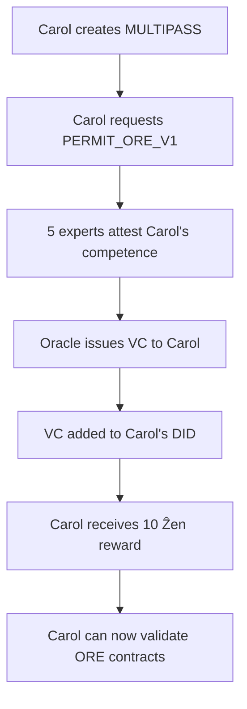
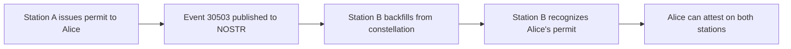

# NIP-101: UPlanet Decentralized Identity & Geographic Coordination Protocol

`draft` `optional`

**Authors:** Astroport.ONE Contributors  
**Status:** Draft for Community Review  
**Version:** 2.0  
**Repository:** [github.com/papiche/NIP-101](https://github.com/papiche/NIP-101)

---

## Abstract

NIP-101 defines a comprehensive protocol for **decentralized identity management**, **geographic coordination**, and **verifiable credentials** on Nostr. It extends the Nostr protocol with four integrated systems:

1. **Hierarchical GeoKeys** - Nostr keypairs derived from geographic coordinates
2. **Decentralized Identity (DID)** - W3C-compliant identities stored as Nostr events (kind 30311)
3. **Oracle System** - Multi-signature permit management using Web of Trust (kinds 30500-30503)
4. **ORE System** - Environmental obligations attached to geographic cells (kinds 30400-30402)

This NIP enables **geographically localized communication**, **self-sovereign identity**, **peer-validated credentials**, and **ecological commitment tracking** on a fully decentralized network.

---

## Table of Contents

- [Motivation](#motivation)
- [Specification](#specification)
  - [1. Hierarchical GeoKeys](#1-hierarchical-geokeys)
  - [2. Decentralized Identity (DID)](#2-decentralized-identity-did)
  - [3. Oracle System (Permits)](#3-oracle-system-permits)
  - [4. ORE System (Environmental Obligations)](#4-ore-system-environmental-obligations)
  - [5. Event Tags](#5-event-tags)
- [Implementation](#implementation)
  - [Constellation Synchronization](#constellation-synchronization)
  - [Authentication (NIP-42)](#authentication-nip-42)
  - [Key Management](#key-management)
- [Use Cases](#use-cases)
- [Security Considerations](#security-considerations)
- [References](#references)

---

## Motivation

### Problems Solved

Current Nostr implementations lack:
- **Geographic context** for location-based communication
- **Standardized identity documents** for self-sovereign identity
- **Verifiable credentials** for competence and authority
- **Environmental accountability** mechanisms

### UPlanet's Solution

**NIP-101** provides a unified protocol that:
- ✅ Creates **localized Nostr feeds** (UMAP, SECTOR, REGION)
- ✅ Implements **W3C-compliant DIDs** on Nostr (no centralized registries)
- ✅ Enables **peer-validated licensing** (driver's license, professional certifications)
- ✅ Tracks **environmental commitments** with economic incentives
- ✅ Supports **constellation synchronization** across multiple relays

---

## Specification

### 1. Hierarchical GeoKeys

Nostr keypairs are **deterministically derived** from geographic coordinates and a namespace string.

#### Key Derivation

**Seed Format:**
```
"{UPLANETNAME}_{FORMATTED_LATITUDE}" "{UPLANETNAME}_{FORMATTED_LONGITUDE}"
```

Used as [libsodium](https://doc.libsodium.org/) salt & pepper for deterministic key generation.

#### Grid Levels

| Level | Precision | Area Size | Example Seed |
|-------|-----------|-----------|--------------|
| **UMAP** | 0.01° | ~1.2 km² | `"UPlanetV148.85-2.34"` |
| **SECTOR** | 0.1° | ~100 km² | `"UPlanetV148.8-2.3"` |
| **REGION** | 1.0° | ~10,000 km² | `"UPlanetV148-2"` |

#### Key Generation Algorithm

Uses the Astroport `keygen` tool to generate:
- **NOSTR keypair** (secp256k1)
- **IPFS key** (ed25519)
- **Ğ1 wallet** (ed25519)
- **Bitcoin address** (secp256k1)

All from the same seed, creating a **Twin-Key** mechanism.

---

### 2. Decentralized Identity (DID)

#### Event Type: `kind:30311`

DIDs are stored as **Parameterized Replaceable Events** ([NIP-33](https://github.com/nostr-protocol/nips/blob/master/33.md)).

#### Standard Tags

```json
{
  "kind": 30311,
  "tags": [
    ["d", "did"],
    ["t", "uplanet"],
    ["t", "did-document"]
  ],
  "content": "{JSON_DID_DOCUMENT}"
}
```

#### DID Document Structure

```json
{
  "@context": [
    "https://www.w3.org/ns/did/v1",
    "https://w3id.org/security/suites/ed25519-2020/v1"
  ],
  "id": "did:nostr:<hex_pubkey>",
  "verificationMethod": [{
    "id": "did:nostr:<hex_pubkey>#key-1",
    "type": "Ed25519VerificationKey2020",
    "controller": "did:nostr:<hex_pubkey>",
    "publicKeyMultibase": "z<base58btc_encoded_key>"
  }],
  "service": [
    {
      "id": "#ipfs-drive",
      "type": "IPFSDrive",
      "serviceEndpoint": "ipns://<ipfs_key>/<email>/APP"
    },
    {
      "id": "#g1-wallet",
      "type": "Ğ1Wallet",
      "serviceEndpoint": "g1:<g1_pubkey>"
    }
  ],
  "verifiableCredential": [
    {
      "@context": "https://www.w3.org/2018/credentials/v1",
      "id": "urn:uuid:...",
      "type": ["VerifiableCredential", "UPlanetLicense"],
      "issuer": "did:nostr:<authority_hex>",
      "credentialSubject": {
        "id": "did:nostr:<subject_hex>",
        "license": "PERMIT_ORE_V1"
      }
    }
  ],
  "metadata": {
    "email": "user@example.com",
    "contractStatus": "active",
    "created": "2024-01-01T12:00:00Z",
    "updated": "2025-10-30T14:30:00Z"
  }
}
```

#### DID Resolution

- **Format:** `did:nostr:<hex_pubkey>`
- **Query:** Subscribe to `kind:30311` events where `pubkey == <hex_pubkey>`
- **Verification:** Use the embedded `verificationMethod` to verify signatures

#### Benefits

- ✅ **No centralized registries** (Nostr relays are the source of truth)
- ✅ **Self-sovereign** (users control their identity via private key)
- ✅ **W3C compliant** (works with standard DID resolvers)
- ✅ **Multi-chain** (links NOSTR, IPFS, Ğ1, Bitcoin)
- ✅ **Verifiable Credentials** (embedded in DID document)

---

### 3. Oracle System (Permits)

The Oracle System enables **peer-validated certification** using the Web of Trust model.

#### NOSTR Event Kinds

| Kind | Name | Description | Signed by | Replaceability |
|------|------|-------------|-----------|----------------|
| **30500** | Permit Definition | License type definition | `UPLANETNAME.G1` | Parameterized Replaceable |
| **30501** | Permit Request | Application from user | Applicant | Parameterized Replaceable |
| **30502** | Permit Attestation | Expert signature | Attester | Parameterized Replaceable |
| **30503** | Permit Credential | Final VC | `UPLANETNAME.G1` | Parameterized Replaceable |

#### Event Structure

##### 30500: Permit Definition
```json
{
  "kind": 30500,
  "pubkey": "<UPLANETNAME_G1_hex>",
  "tags": [
    ["d", "PERMIT_ORE_V1"],
    ["t", "uplanet"],
    ["t", "permit-definition"]
  ],
  "content": "{
    \"id\": \"PERMIT_ORE_V1\",
    \"name\": \"ORE Environmental Verifier\",
    \"description\": \"Authority to verify ORE contracts\",
    \"min_attestations\": 5,
    \"validity_years\": 3,
    \"reward_zen\": 10
  }"
}
```

##### 30501: Permit Request
```json
{
  "kind": 30501,
  "pubkey": "<applicant_hex>",
  "tags": [
    ["d", "<request_id>"],
    ["permit", "PERMIT_ORE_V1"],
    ["t", "uplanet"]
  ],
  "content": "{
    \"statement\": \"I have expertise in ecological validation\",
    \"evidence\": \"https://ipfs.io/ipfs/Qm...\"
  }"
}
```

##### 30502: Permit Attestation
```json
{
  "kind": 30502,
  "pubkey": "<attester_hex>",
  "tags": [
    ["d", "<attestation_id>"],
    ["e", "<request_event_id>"],
    ["p", "<applicant_hex>"],
    ["permit", "PERMIT_ORE_V1"]
  ],
  "content": "{
    \"statement\": \"I attest to this applicant's competence\",
    \"date\": \"2025-10-30T12:00:00Z\"
  }"
}
```

##### 30503: Permit Credential (VC)
```json
{
  "kind": 30503,
  "pubkey": "<UPLANETNAME_G1_hex>",
  "tags": [
    ["d", "<credential_id>"],
    ["p", "<holder_hex>"],
    ["permit", "PERMIT_ORE_V1"]
  ],
  "content": "{
    \"@context\": \"https://www.w3.org/2018/credentials/v1\",
    \"id\": \"urn:uuid:...\",
    \"type\": [\"VerifiableCredential\", \"UPlanetLicense\"],
    \"issuer\": \"did:nostr:<UPLANETNAME_G1_hex>\",
    \"issuanceDate\": \"2025-10-30T12:00:00Z\",
    \"expirationDate\": \"2028-10-30T12:00:00Z\",
    \"credentialSubject\": {
      \"id\": \"did:nostr:<holder_hex>\",
      \"license\": \"PERMIT_ORE_V1\",
      \"attestations\": 5
    }
  }"
}
```

#### WoT Bootstrap ("Block 0")

**Problem:** How to initialize a permit when no holders exist yet?

**Solution:** For a permit requiring **N signatures**, register **N+1 MULTIPASS members** on the station.

**Cross-Attestation Process:**
1. Each member attests all other members (except themselves)
2. Result: Each member receives **N attestations**
3. Oracle issues credentials to all members simultaneously

**Examples:**
- **PERMIT_ORE_V1** (5 signatures) → 6 members (each receives 5 attestations)
- **PERMIT_DRIVER** (12 signatures) → 13 members (each receives 12 attestations)
- **PERMIT_WOT_DRAGON** (3 signatures) → 4 members (each receives 3 attestations)

#### Permit Lifecycle


#### Available Permits

| Permit ID | Name | Attestations | Validity | Reward |
|-----------|------|--------------|----------|--------|
| PERMIT_ORE_V1 | ORE Verifier | 5 | 3 years | 10 Ẑen |
| PERMIT_DRIVER | Driver's License | 12 | 15 years | 5 Ẑen |
| PERMIT_WOT_DRAGON | UPlanet Authority | 3 | Unlimited | 50 Ẑen |
| PERMIT_MEDICAL_FIRST_AID | First Aid | 8 | 2 years | 8 Ẑen |
| PERMIT_BUILDING_ARTISAN | Artisan | 10 | 5 years | 12 Ẑen |
| PERMIT_EDUCATOR_COMPAGNON | Educator | 12 | Unlimited | 15 Ẑen |
| PERMIT_FOOD_PRODUCER | Food Producer | 6 | 3 years | 8 Ẑen |
| PERMIT_MEDIATOR | Mediator | 15 | 5 years | 20 Ẑen |

---

### 4. ORE System (Environmental Obligations)

The ORE System attaches **environmental obligations** to geographic cells (UMAP), creating a decentralized ecological registry.

#### NOSTR Event Kinds

| Kind | Name | Description | Signed by |
|------|------|-------------|-----------|
| **30400** | ORE Definition | Environmental contract | UMAP DID |
| **30401** | ORE Validation | Verification report | ORE Expert |
| **30402** | ORE Reward | Payment confirmation | UPLANETNAME.RnD |

#### Event Structure

##### 30400: ORE Definition
```json
{
  "kind": 30400,
  "pubkey": "<UMAP_hex>",
  "tags": [
    ["d", "<ore_contract_id>"],
    ["latitude", "43.60"],
    ["longitude", "1.44"],
    ["t", "uplanet"],
    ["t", "ore-contract"]
  ],
  "content": "{
    \"contractId\": \"ORE-2025-001\",
    \"description\": \"Maintain 80% forest cover\",
    \"provider\": \"did:nostr:<verifier_hex>\",
    \"reward\": \"10\",
    \"validationMethod\": \"satellite\",
    \"frequency\": \"annual\"
  }"
}
```

##### 30401: ORE Validation
```json
{
  "kind": 30401,
  "pubkey": "<expert_hex>",
  "tags": [
    ["d", "<validation_id>"],
    ["e", "<ore_contract_event_id>"],
    ["permit", "PERMIT_ORE_V1"],
    ["latitude", "43.60"],
    ["longitude", "1.44"]
  ],
  "content": "{
    \"result\": \"compliant\",
    \"evidence\": \"ipfs://Qm...\",
    \"method\": \"satellite_imagery\",
    \"date\": \"2025-10-30T12:00:00Z\",
    \"notes\": \"Forest cover: 82%\"
  }"
}
```

##### 30402: ORE Reward
```json
{
  "kind": 30402,
  "pubkey": "<UPLANETNAME_RnD_hex>",
  "tags": [
    ["d", "<reward_id>"],
    ["e", "<validation_event_id>"],
    ["p", "<UMAP_hex>"],
    ["amount", "10"]
  ],
  "content": "{
    \"transaction_id\": \"G1_TX_123...\",
    \"amount\": \"10\",
    \"currency\": \"ZEN\",
    \"date\": \"2025-10-30T12:05:00Z\"
  }"
}
```

#### ORE in DID Documents

Environmental obligations are stored in the UMAP's DID document (kind 30311):

```json
{
  "id": "did:nostr:<UMAP_hex>",
  "type": "UMAPGeographicCell",
  "geographicMetadata": {
    "coordinates": {"lat": 43.60, "lon": 1.44}
  },
  "environmentalObligations": {
    "oreContract": {
      "contractId": "ORE-2025-001",
      "description": "Maintain 80% forest cover",
      "provider": "did:nostr:<verifier_hex>",
      "reward": "10"
    },
    "verificationStatus": "verified",
    "lastVerification": "2025-10-30T12:00:00Z"
  }
}
```

#### Economic Flow

```
1. ORE Contract → UMAP DID (kind 30311)
2. Expert Validation → NOSTR event (kind 30401)
3. Automatic Payment → UPLANETNAME.RnD → UMAP Wallet (kind 30402)
4. UMAP Redistribution → Local guardians/residents
```

#### Cost Comparison

| Aspect | Traditional ORE (Notarized) | UPlanet ORE (Decentralized) |
|--------|----------------------------|----------------------------|
| **Notary Fees** | €1,500 - €3,000 | €0 |
| **Legal Drafting** | €2,000 - €5,000 | €0 |
| **Registry** | €500 - €1,000 | €0 |
| **Annual Audit** | €1,000 - €2,000/year | Volunteer experts |
| **Verification** | In-person visits | Satellite + IoT + VDO.ninja |
| **Total (5 years)** | €9,500 - €19,000 | ~€50 (hosting) |

**Savings:** **99.7%** cost reduction while increasing transparency and participation.

---

### 5. Event Tags

All UPlanet events SHOULD include these tags:

#### Geographic Tags
```json
["latitude", "FLOAT_STRING"]
["longitude", "FLOAT_STRING"]
["application", "UPlanet"]
```

#### Identity Tags
```json
["did", "did:nostr:<hex_pubkey>"]
["t", "uplanet"]
```

#### Permit Tags (30501-30503)
```json
["permit", "PERMIT_ID"]
["e", "<related_event_id>"]
["p", "<related_pubkey>"]
```

#### ORE Tags (30400-30402)
```json
["ore", "ORE_CONTRACT_ID"]
["latitude", "FLOAT_STRING"]
["longitude", "FLOAT_STRING"]
```

---

## Implementation

### Constellation Synchronization

UPlanet relays synchronize all NIP-101 events across the constellation network.

#### Synchronized Event Kinds

| Category | Kinds | Description |
|----------|-------|-------------|
| **Core** | 0, 1, 3, 5, 6, 7 | Profiles, notes, contacts, deletions, reposts, reactions |
| **Media** | 21, 22 | Videos (short/long form) |
| **Content** | 30023, 30024 | Articles, calendar events |
| **Identity** | 30311 | DID documents |
| **Oracle** | 30500-30503 | Permits (definitions, requests, attestations, credentials) |
| **ORE** | 30400-30402 | Environmental obligations (contracts, validations, rewards) |

**Total:** **19 event types** synchronized automatically

#### Backfill Process

```bash
# Automatic daily synchronization (via _12345.sh)
./backfill_constellation.sh --days 1

# Manual full sync
./backfill_constellation.sh --days 7 --verbose

# View constellation statistics
./backfill_constellation.sh --stats
```

#### Statistics Example

```log
[2025-10-30 12:35:12] [INFO] SYNC_STATS: 
  events=1523 
  dms=45 
  public=1478 
  deletions=12 
  videos=8 
  did=34 
  oracle=23 
  ore=15
```

#### Discovery Mechanism

1. **IPNS Swarm Scan** → `~/.zen/tmp/swarm/*/12345.json`
2. **Extract Relay URLs** → `myRELAY` field
3. **HEX Pubkey Collection** → `~/.zen/game/nostr/*/HEX`
4. **WebSocket Backfill** → Direct or via P2P tunnels
5. **Strfry Import** → Local database update

---

### Authentication (NIP-42)

All UPlanet API operations require **NIP-42 authentication**.

#### Authentication Flow

1. **Client** generates auth event (kind 22242)
2. **Client** sends auth event to relay
3. **Server** queries relay for recent auth event
4. **Server** verifies signature and challenge
5. **Server** authorizes request

#### Example Auth Event

```json
{
  "kind": 22242,
  "pubkey": "<user_hex>",
  "tags": [
    ["relay", "ws://127.0.0.1:7777"],
    ["challenge", "<random_challenge>"]
  ],
  "content": "",
  "created_at": 1730289600
}
```

#### API Integration

```bash
# User authenticates via NOSTR
curl -X POST https://api.example.com/api/permit/request \
  -H "X-Nostr-Auth: <auth_event_id>" \
  -d '{"permit_type": "PERMIT_ORE_V1"}'
```

---

### Key Management

#### Twin-Key Mechanism

From a single seed, generate:
- **NOSTR keypair** (identity)
- **IPFS key** (storage)
- **Ğ1 wallet** (economy)
- **Bitcoin address** (interoperability)

#### Shamir Secret Sharing (SSSS)

Private keys are split into **3 fragments**:
- Fragment 1 → Local storage
- Fragment 2 → IPFS encrypted backup
- Fragment 3 → Trusted guardian

**Reconstitution:** Any **2 fragments** can restore the full private key.

#### Key Storage

```
~/.zen/game/nostr/<EMAIL>/
  ├── .secret.nostr         # NOSTR private key
  ├── HEX                   # NOSTR public key (hex)
  ├── NPUBcopyright.png     # QR code (npub)
  ├── GPGPASS               # Encryption password
  ├── .ssss/                # Shamir fragments
  │   ├── fragment_1.txt
  │   ├── fragment_2.txt.gpg
  │   └── fragment_3.txt.gpg
  └── APP/                  # IPFS drive
```

---

## Use Cases

### 1. Localized Community Chat

**Scenario:** Alice posts from her neighborhood UMAP.

```json
{
  "kind": 1,
  "pubkey": "<alice_hex>",
  "tags": [
    ["p", "<UMAP_hex>"],
    ["latitude", "43.6047"],
    ["longitude", "1.4442"],
    ["application", "UPlanet"]
  ],
  "content": "Community garden meeting tomorrow at 10am!"
}
```

**Bob**, subscribed to that UMAP's `npub`, sees the message instantly.

---

### 2. ORE Verifier Certification

**Scenario:** Carol wants to become an ORE verifier.



**API Flow:**
```bash
# 1. Carol requests permit
POST /api/permit/request
{
  "permit_type": "PERMIT_ORE_V1",
  "statement": "I have ecological expertise",
  "evidence": "ipfs://Qm..."
}

# 2. Experts attest (5 times)
POST /api/permit/attest
{
  "request_id": "req_123",
  "statement": "I attest to Carol's competence"
}

# 3. Oracle auto-issues VC (when threshold reached)
# 4. Carol's DID updated with new credential
# 5. Carol receives economic reward
```

---

### 3. Environmental Commitment Tracking

**Scenario:** Dave's UMAP commits to maintaining forest cover.

```json
{
  "kind": 30400,
  "pubkey": "<UMAP_hex>",
  "tags": [
    ["d", "ORE-2025-DAVE-001"],
    ["latitude", "48.85"],
    ["longitude", "-2.34"]
  ],
  "content": "{
    \"description\": \"Maintain 80% forest cover\",
    \"reward\": \"10\",
    \"provider\": \"did:nostr:<carol_hex>\"
  }"
}
```

**Annual Verification:**
1. Carol (certified ORE expert) validates via satellite imagery
2. Carol publishes validation event (kind 30401)
3. System automatically triggers 10 Ẑen payment to Dave's UMAP
4. Dave redistributes to local guardians

**Economic Incentive:** Dave's UMAP earns **50 Ẑen over 5 years** for maintaining forest.

---

### 4. Automated Weather Alert

**Scenario:** Automated service publishes weather alerts for REGION Paris.

```json
{
  "kind": 1,
  "pubkey": "<REGION_PARIS_hex>",
  "tags": [
    ["latitude", "48.8534"],
    ["longitude", "2.3488"],
    ["application", "UPlanet"],
    ["t", "weather-alert"]
  ],
  "content": "⚠️ Storm warning: Heavy rainfall expected 18:00-22:00"
}
```

All users subscribed to the Paris REGION GeoKey receive the alert.

---

### 5. Multi-Station Permit Recognition

**Scenario:** Alice has a permit from Station A, visits Station B.



**Result:** **Decentralized permit recognition** across the entire UPlanet network.

---

## Security Considerations

### Location Disclosure

- **Risk:** Publishing precise coordinates reveals location
- **Mitigation:** 
  - Use broader grid levels (SECTOR, REGION) for privacy
  - Implement selective disclosure (only trusted contacts see precise location)
  - Client-side filtering of location data

### Tracking

- **Risk:** Frequent geo-tagged posts enable movement tracking
- **Mitigation:**
  - Rotate nyms (secondary keys) for location-based posts
  - Use GeoKey as location identity instead of personal key
  - Implement ephemeral location tags

### Namespace Security

- **Risk:** Compromise of `UPLANETNAME` disrupts entire system
- **Mitigation:**
  - Store `UPLANETNAME` in secure IPFS swarm key
  - Distribute only to trusted constellation members
  - Implement key rotation procedures

### Permit Fraud

- **Risk:** Fake attestations or credential forgery
- **Mitigation:**
  - All events cryptographically signed (Schnorr)
  - Verify attester holds valid permit before accepting attestation
  - Oracle validates entire attestation chain before issuing VC
  - Multi-signature requirement (no single point of trust)

### Sybil Attacks

- **Risk:** Single entity creates multiple fake identities to self-attest
- **Mitigation:**
  - Require attesters to be in Ğ1 Web of Trust (verified humans)
  - Bootstrap requires real MULTIPASS registrations
  - Economic cost (Ẑen) for permit applications

### Oracle Manipulation

- **Risk:** Authority key (`UPLANETNAME.G1`) could issue fraudulent permits
- **Mitigation:**
  - Authority key held by cooperative governance (multi-sig)
  - All issued permits are public and auditable on NOSTR
  - Community can reject malicious credentials
  - Economic incentives aligned with honest behavior

---

## Compatibility

### Nostr Compatibility

- ✅ Uses standard event kinds where possible (0, 1, 3, etc.)
- ✅ Follows NIP-01 (Basic protocol)
- ✅ Implements NIP-10 (`e` and `p` tags)
- ✅ Implements NIP-33 (Parameterized Replaceable Events)
- ✅ Implements NIP-42 (Authentication)
- ✅ Compatible with existing Nostr clients (with extensions)

### W3C Compatibility

- ✅ DIDs follow W3C DID Core Specification
- ✅ Verifiable Credentials follow W3C VC Data Model
- ✅ Signature format compatible with `Ed25519VerificationKey2020`

### Blockchain Compatibility

- ✅ Ğ1 wallet integration (Duniter)
- ✅ Bitcoin address derivation
- ✅ Future: Ethereum address support

---

## References

### Nostr NIPs

- [NIP-01](https://github.com/nostr-protocol/nips/blob/master/01.md): Basic protocol flow
- [NIP-07](https://github.com/nostr-protocol/nips/blob/master/07.md): Browser extensions
- [NIP-10](https://github.com/nostr-protocol/nips/blob/master/10.md): Conventions for `e` and `p` tags
- [NIP-11](https://github.com/nostr-protocol/nips/blob/master/11.md): Relay information
- [NIP-33](https://github.com/nostr-protocol/nips/blob/master/33.md): Parameterized Replaceable Events
- [NIP-42](https://github.com/nostr-protocol/nips/blob/master/42.md): Authentication

### W3C Standards

- [DID Core Specification](https://www.w3.org/TR/did-core/)
- [Verifiable Credentials Data Model](https://www.w3.org/TR/vc-data-model/)
- [Ed25519 Verification Key 2020](https://w3id.org/security/suites/ed25519-2020/v1)

### UPlanet Documentation

- **Main Repository:** [github.com/papiche/Astroport.ONE](https://github.com/papiche/Astroport.ONE)
- **NIP-101 Repository:** [github.com/papiche/NIP-101](https://github.com/papiche/NIP-101)
- **Oracle System:** [docs/ORACLE_SYSTEM.md](../Astroport.ONE/docs/ORACLE_SYSTEM.md)
- **ORE System:** [docs/ORE_SYSTEM.md](../Astroport.ONE/docs/ORE_SYSTEM.md)
- **DID Implementation:** [DID_IMPLEMENTATION.md](../Astroport.ONE/DID_IMPLEMENTATION.md)
- **Public Portal:** [copylaradio.com](https://ipfs.copylaradio.com/ipns/copylaradio.com)

### Technical Tools

- [libsodium](https://doc.libsodium.org/): Cryptographic library
- [strfry](https://github.com/hoytech/strfry): High-performance Nostr relay
- [Duniter](https://duniter.org/): Ğ1 libre currency implementation

### Articles & Research

- [Web of Trust for Driver's License](https://www.copylaradio.com/blog/blog-1/post/reinventer-la-societe-avec-la-monnaie-libre-et-la-web-of-trust-148) (French)
- [Environmental Real Obligations (ORE)](https://www.ecologie.gouv.fr/) (French legal framework)

---

## Implementation Status

### ✅ Implemented

- Hierarchical GeoKeys (UMAP, SECTOR, REGION)
- DID documents on NOSTR (kind 30311)
- Oracle permit system (kinds 30500-30503)
- ORE environmental contracts (kinds 30400-30402)
- Constellation synchronization (backfill)
- NIP-42 authentication
- Web interface (`/oracle`)
- API routes (FastAPI)
- Twin-Key derivation (NOSTR, IPFS, Ğ1, Bitcoin)

### 🚧 In Progress

- Mobile client integration
- Advanced ORE verification (satellite imagery)
- VDO.ninja integration for live validation
- Multi-language support

### 📋 Planned

- Reputation system for attesters
- Dispute resolution mechanism
- Cross-chain bridge (Ethereum)
- Anonymous credentials (zero-knowledge proofs)
- Geographic privacy modes

---

## Community Feedback

We invite the Nostr community to review and provide feedback on NIP-101.

### Discussion Topics

1. **Event Kind Allocation:** Are kinds 30500-30503 (Oracle) and 30400-30402 (ORE) acceptable?
2. **DID Integration:** Should DIDs be stored in kind 30311 or a dedicated kind?
3. **Geographic Tags:** Are `latitude`/`longitude` tags sufficient, or should we use GeoJSON?
4. **Constellation Sync:** Should backfill be standardized across all Nostr implementations?
5. **Economic Layer:** How to integrate Ğ1/Ẑen payments with other Nostr economic systems?

### How to Contribute

- **GitHub Issues:** [github.com/papiche/NIP-101/issues](https://github.com/papiche/NIP-101/issues)
- **Pull Requests:** Improvements to spec or implementation
- **Discussions:** [github.com/papiche/NIP-101/discussions](https://github.com/papiche/NIP-101/discussions)
- **Testing:** Deploy a UPlanet station and report feedback

---

## License

This specification is released under **AGPL-3.0**.

Implementation code is available at:
- [Astroport.ONE](https://github.com/papiche/Astroport.ONE) (AGPL-3.0)
- [NIP-101](https://github.com/papiche/NIP-101) (AGPL-3.0)

---

## Authors & Acknowledgments

**Lead Developers:**
- [papiche](https://github.com/papiche) - UPlanet & Astroport.ONE architecture
- CopyLaRadio SCIC - Cooperative governance and economic design

**Contributors:**
- Astroport.ONE community
- Ğ1 libre currency community
- NOSTR protocol community

**Special Thanks:**
- [hoytech](https://github.com/hoytech) - strfry Nostr relay
- [fiatjaf](https://github.com/fiatjaf) - Nostr protocol creator
- Duniter community - Ğ1 blockchain implementation

---

<div align="center">

**🌍 NIP-101: Decentralized Identity, Geographic Coordination & Ecological Accountability on NOSTR**

*Built by the community, for the community* 🤝

[Website](https://ipfs.copylaradio.com/ipns/copylaradio.com) • [GitHub](https://github.com/papiche/NIP-101) • [Documentation](https://github.com/papiche/Astroport.ONE)

</div>
